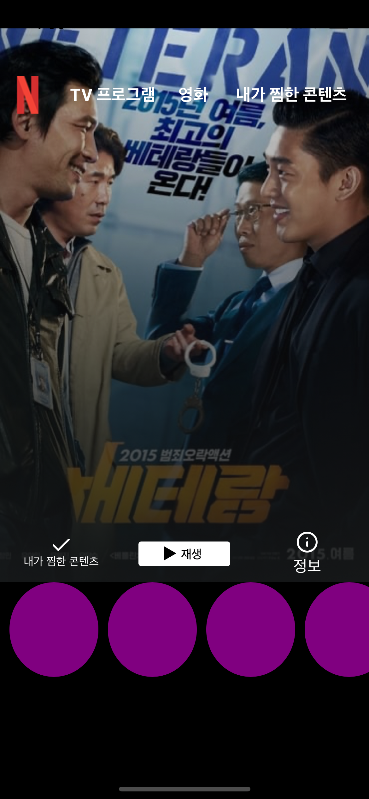
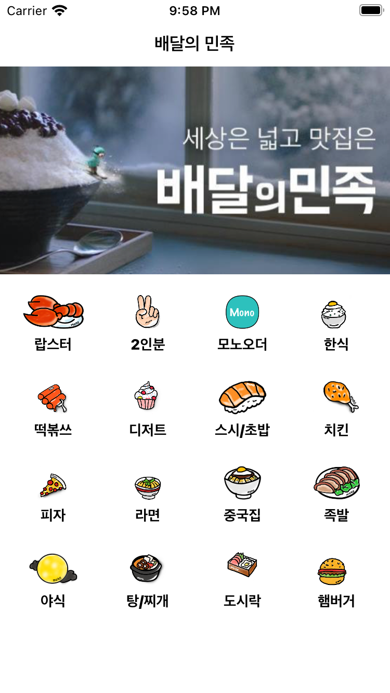

# Assignment

## Netflix UI 그려보기


- 스토리보드를 가급적 사용해서 콜렉션 뷰를 해보았으나 마음처럼 UI가 그려지지 않음, 콜렉션 뷰 구성할 때는 코드가 오히려 더 직관적이고 사용하기 편한 것 같다.
- 섹션 해더를 어떻게 넣어야 할지 몰라서 포기함(다시 공부해서 넣어볼 것)
- 미리보기 섹션은 UIBezierPath를 이용해 원을 그리고 CAShapeLayer()를 통해 뷰 마스크를 씌움
```Swift
import UIKit

class PreviewViewCell: UICollectionViewCell {
  
  @IBOutlet weak var previewImage: UIImageView!
  
  override func layoutSubviews() {
    super.layoutSubviews()
    
    let path = UIBezierPath(ovalIn: contentView.bounds)
    let maskLayer = CAShapeLayer()
    maskLayer.path = path.cgPath
    contentView.layer.mask = maskLayer
    
    contentView.backgroundColor = .purple
  }
}
```
- [넷플릭스 UI그려보기 소스코드](src/netflixCode.swift)

- 이미지는 분명히 할당했는데 왜 이미지가 안들어 가는지 모르겠음

## 배달의 민족 UI 그려보기 Storyboard, UICollectionView


넷플릭스에서 한타임 맞고 조금 깨달은 바가 있어서 이번에는 그마나 구현이 됐다.
이번에는 ViewController안에 CollectionView를 넣어서 구현했다.
Cell Design은 xib을 통해서 했고 CollectionView를 ViewController에서 IBOutlet으로 가져온 뒤 collectionView에 셀을 등록, 레이아웃도 적용했다.
layout은 UICollectionViewLayout을 했는데 잘 적용 되었다.
dataSource 부분도 마찬가지로 잘 적용 되었으나 처음에는 안되었는데 그 이유는 dataSource는 델리게이트 이므로 델리게이트를 소유했어야 하는데 지정하는걸 까먹었다.

- [배민 뷰 컨트롤러 소스코드](src/Delivery.swift)


## Version
버전에 따라 지원하는 Swift언어의 버전, 프레임워크에서 제공하는 기능들이 다르기 때문에 또 그 과정에서 Deprecated 되는 UI와 메소드가 있기 때문에 버전별로 UI가 다르게 표시될 수 있다.
WWDC2021 에서 iOS 15 타겟으로 버튼의 변경점이 많은데 변경점은 아래와 같다
1. Plain, Gray, Tinted, Filled 스타일이 생겼다.
2. Multiline text를 지원한다.
3. Dynamic Type을 기본적으로 지원한다.
4. Subtitle도 지원한다.!
5. Activity Indicator를 버튼 안에서 지원한다.
또 기존에는 UIButton 인스턴스를 생성하고 프로퍼티를 수정할때
```Swift
let button = UIButton()
button.setTitle("New Title", for: .normal) 
```
이런 식으로 수정하였는데

```Swift
var configuration = UIButton.Configuration.tinted()
configuration.title = "new title"
let button = UIButton(configuration: configurion..)
```
configuration을 통해 프로퍼티 설정이 가능하다.

[그 외에 Deprecated 된 프로퍼티 일람](https://developer.apple.com/documentation/uikit/uibutton/deprecated_button_properties_and_methods)
