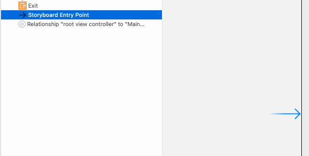

# SSAC 2회차 Checklist

## - Bundle Identifier
Bundle Identifier는 앱의 고유 식별 코드로, 기본 상태는 Organization Identifier + Product Name으로 자동생성된다. 앱스토어에 등록될 때 고유해야 하므로 관례적으로 도메인의 역순으로 작성하며 예를들어 `com.gookbob.APPname` 와 같이 쓰인다.

## - SF Symbols
SF Symbols Apple 플랫폼용 시스템 글꼴 San Francisco와 원활하게 통합되도록 설계된 아이콘 라이브러리이다.
[SFSymbol](https://developer.apple.com/sf-symbols/)<br>
*SF Symbols 3*은 쉽고 빠르게 검색하고 복사 붙여넣기 할 수있는 맥 어플리케이션으로 설치해두면 유용하다.

## - Human Interface Guidelines
이하 HIG는 애플리케이션을 개발할 때 디자인 및 기능 구성 방법에 대한 가이드라인으로 Apple은 이러한 지침과 일관성을 통해 사용자가 애플리케이션을 처음 접하더라도 대부분의 iOS 사용자에게 익숙한 환경을 제공한다.

특히 iOS에서 3가지 기본 테마로 다른 플랫폼과 차별화 두는데 *Clarity*, *Deference*, *Depth* 이 있다.
[HIG 공식 문서](https://developer.apple.com/design/human-interface-guidelines/ios/overview/themes/)<br>
[HIG 한글 번역](https://wnsah052.tistory.com/9)

주로 살펴보아야 할 구성은

  - Overview : iOS 플랫폼 테마의 특징과 인터페이스 요소에 관한 개요
  - App Architecture : 애플리케이션 아키텍처 설계시 고려사항을 설명한다.
  - User Interaction : 애플리케이션 사용자와 상호작용하는 동작 설계 시 고려해야 할 사항
  - System Capabilites : 시스템이 지원하는 여러 시스템 기능과 각 기능에 대해 설계 시 고려해야 할 사항
  - Visual Design : 애플리케이션의 시각적인 요소 설계 시 고려해야 할 사항을 설명
  - Icons and Images : iOS에서 이미지, 아이콘, 시작화면에 관한 내용과 지침에 관한 내용을 설명
  - Bars : iOS에서 사용하는 바의 각 역할과 용도에 관한 설명
  - Views : 뷰의 종류와 역할에 관해 설명하고 뷰 설계 시 고려해야 할 사항
  - Controls : 여러 가지 컨트롤 요소들에 관한 소개와 설계 시 고려해야 할 사항들에 관한 내용
  - Extensions : 여러가지 확장 기능을 소개하고 확장 기능을 사용하는 애플리케이션 설계 시 고려해야 할 사항들에 관해 설명
  - Technologies : 여러 기술을 구현할 수 있는 kit에 관해 설명하고 해당 kit 사용 시 설계 지침에 관한 내용
  - Resources : OS를 포함한 애플의 플랫폼들에 대한 자원 제공에 관한 내용


## - UIKit
아이폰이나 아이패드와 같은 애플 환경등에서 실행되는 애플리케이션의 유저 인터페이스를 제공하는 코코아 터치 프레임워크의 하위 키트, UIKit에 해당되는 개체는 모두 `UI`라는 수식이 먼저 나온다. 예를들어 UIButton, UILable, UITextField, UIViewController 등<br>
[UIKit](https://developer.apple.com/documentation/uikit/)

## - Launch Screen
스플래시 스크린이라고도 하며, 앱이 구동될 때 처음 보여주는 시작 화면이다. 메인 뷰를 불러오는 동안 빈 화면을 보여주지 않기 위해 짧게 노출되는 스크린

## - Entry Point
 엔트리포인트는 앱의 시작지점을 지정하는 개체로 
스토리보드 화면에서 처음 볼 수 있다.<br>
해당 앤트리포인트를 삭제 후 어플리케이션을 실행시켜보면 아무 화면도 표시되지 않는데 말 그대로 시작지점을 지정하지 않아서 그렇다.
이렇게 삭제된 Entry Point는 Storyboard의 Controller-Attribute Inspector-View Controller-is Initial View Controller 를 체크 해서 다시 생성할 수 있다.

  - @main : App Delegate에 가서 @main을 지우고 빌드하면 `Entry point (_main) undefined. for architecture arm64`라는 오류를 볼 수 있는데 @main은 내부적으로 main 함수를 불러온다. C/C++ 에서 프로그램의 시작는 int main() 에서 시작하듯 swift도 *사실은* 그러하다.

## - Simulator Build(Xcode를 통하지 않고 프로젝트 빌드, 시뮬레이터 빌드)
>Reference [1](https://blog.devgenius.io/simulator-build-for-ios-842c8106ca27), [2](https://developers.facebook.com/docs/ios/create-a-simulator-build/)

[ios-sim](https://github.com/ios-control/ios-sim)
은 ios 시뮬레이터에서 iOS 앱을 실행할 수 있는 command-line 유틸리티로 이를 통해 Xcode를 열지 않고 자동화된 테스트와 같은 기능을 사용할 수 있다.

terminal 에서
```
ios-sim launch APPNAME.app -d iPhone-13-mini
```

.app 파일은 Xcode에서 릴리즈로 빌드시 `/Library/Developer/DerivedData/Xcode/APPNAME-HASHSTRING/Build/Products/Release-iphonesimulator`에 위치한다.

Xcode-Prefernece에서 바로 이동할 수도 있고 앱 디버깅시 위치를 출력해서 접근할 수도 있지만 Terminal.app을 통해서 프로젝트 폴더에 바로 생성할 수도 있다.

`APPNAME.xcodeproj` 이 있는 디렉토리로 이동해서

terminal에서 아래처럼 입력한다.
```
xcodebuild -sdk iphonesimulator
```
잠시 기다리면 위에서 찾았던 디렉토리와 동일한 폴더가 생성되며 Release-iphonesimulator를 찾아 ios-sim을 실행 시키면 된다.
