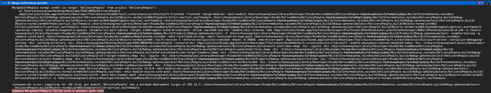

# Mission

## 최소 버전을 iOS 12.0으로 설정했을 때 빌드 오류
12.0은 커녕 14.0 아래로도 못내렸다.

모듈을 합하는 과정에서 발생하는 에러라고 하는데 사용한 메소드나 기능 중에 14.7 이상에서만 가능한 기능은 없는 걸로 안다.
다만 추측할 수 있는 것은 SceneDelegate가 iOS13 부터 사용되기 시작 하였으므로 
```Swift
@available (iOS 13.0, *)
```
속성 어노테이션을 통해 해당 버전 아래에서는 사용하지 않는 기능이라고 명시를 해야 한다

