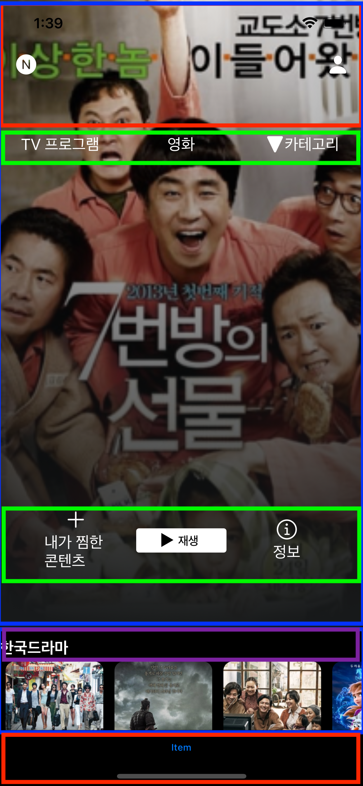

# Netflix Project 완성하기

Storyboard와 IBOutlet, IBAction을 이용하여 Netflix UI를 구성해 본다.<br>
<br>
Netflix의 메인 화면을 보면  네비게이션바, 단일 뷰(각종 버튼을 포함한), 하단의 콜렉션 뷰 셀, 그리고 탭 바로 구성되어있다.

## 네비게이션 바
네비게이션은 넷플릭스 홈버튼, 유저 프로필 버튼으로 구성되어 있는데 실제 앱은 아래 TV프로그램, 영화, 카테고리 모두 네비게이션 바 처럼 동작하는 것처럼 보인다. 단순히 뷰 계층을 하나 더 생성해서 비슷하게 동작하게 하는건지 아니면 저렇게 애초에 네비게이션 바가 구성이 가능한지 커스텀 네비게이션 키워드로 찾아볼 것

`MainCollectionViewController`
```Swift
class MainCollectionViewController {
  ...
  override func viewDidLoad() {
    super.viewDidLoad()
    navigationController?.navigationBar.backgroundColor = .clear
    navigationController?.navigationBar.setBackgroundImage(UIImage(), for: .default)
    navigationController?.navigationBar.shadowImage = UIImage()
    navigationController?.hidesBarsOnSwipe = true
    ...
  }
}
```
위와 같이 설정하여 네비게이션 바 아래로 뷰를 투영할 수 있다. `hidesBarsOnSwipe` 속성은 true로 토글하게 되면 유저가 스와이프 동작을 하게 되면 위로 사라지거나 나타난다

## 단일 메인 뷰
메인 뷰는 가장 크게 영화를 추전해주는 메인 뷰로 이것도 콜렉션 셀로 구성했다.
`MainCollectionViewCell`이라는 이름으로 nib파일과 같이 생성하였고 nib을 통해 UI를 배치하였다.
```Swift
import UIKit

class MainCollectionViewCell: UICollectionViewCell {
  
  @IBOutlet weak var mainImage: UIImageView!
  @IBOutlet weak var playButton: UIButton!

}
```
기타 콜렉션 셀도 모두 같은 방식으로 생성하였다.

`MainCollectionViewController` viewDidLoad에서 모두 로드해준다.
```Swift
//viewDidLoad
    let mainCollectionViewCellNibName = UINib(nibName: "\(MainCollectionViewCell.self)", bundle: nil)
    let basicCollectionViewCellNibName = UINib(nibName: "\(BasicCollectionViewCell.self)", bundle: nil)
    let sectionHeaderCollectionViewCellNibName = UINib(nibName: "\(HeaderCollectionViewCell.self)", bundle: nil)
    collectionView.register(mainCollectionViewCellNibName, forCellWithReuseIdentifier: "\(MainCollectionViewCell.self)")
    collectionView.register(basicCollectionViewCellNibName, forCellWithReuseIdentifier: "\(BasicCollectionViewCell.self)")
    collectionView.register(sectionHeaderCollectionViewCellNibName, forSupplementaryViewOfKind: UICollectionView.elementKindSectionHeader, withReuseIdentifier: "\(HeaderCollectionViewCell.self)")
    
```
nib이 있는 뷰는 UINib 인스턴스를 생성하고 collectionView.register로 등록한다. register메소드에는 nibName로 생성할 수 있는 오버라이드가 있다.

여기서 Header로 사용할 셀의 경우는 `forCellWithReuseIdentifier`가 있는 메소드가 아니라 `forSupplementaryViewOfKind`가 있는 메소드로 생성해야 한다. 일반 셀처럼 등록하면 런타임 에러가 발생하니 주의할 것

### CollectionCell layout 구성
이부분을 잘 모르겠는데 CollectionCell을 적절하게 layout 구성을 하려면 꼭 이것을 사용했었다. 해당 방법 말고 좀더 스토리보드? 다운 방법을 따로 찾아봐야 할 것 같다.

```Swift
//MARK: - CollectionView Layout
extension MainCollectionViewController {
  private func layout() -> UICollectionViewLayout {
    return UICollectionViewCompositionalLayout { [weak self] sectionNumber, environment -> NSCollectionLayoutSection? in
      guard let self = self else {return nil}
      
      switch self.data[sectionNumber].sectionType {
      case .main:
        return self.createMainTypeSection()
      case .basic:
        return self.createBasicTypeSection()
      case.netflix:
        return self.createNetflixTypeSection()
      }
    }
    
  }
  
  private func createMainTypeSection() -> NSCollectionLayoutSection {
    let itemSize = NSCollectionLayoutSize(widthDimension: .fractionalWidth(1), heightDimension: .fractionalHeight(1))
    let item = NSCollectionLayoutItem(layoutSize: itemSize)
    let groupSize = NSCollectionLayoutSize(widthDimension: .fractionalWidth(1), heightDimension: .fractionalHeight(0.8))
    let group = NSCollectionLayoutGroup.vertical(layoutSize: groupSize, subitem: item, count: 1)
    let section = NSCollectionLayoutSection(group: group)
    section.contentInsets = .init(top: 0, leading: 0, bottom: 5, trailing: 0)
    return section
  }
  
  private func createBasicTypeSection() -> NSCollectionLayoutSection {
    let itemSize = NSCollectionLayoutSize(widthDimension: .fractionalWidth(1), heightDimension: .fractionalHeight(1))
    let item = NSCollectionLayoutItem(layoutSize: itemSize)
    item.contentInsets = .init(top: 0, leading: 6, bottom: 0, trailing: 6)
    let groupSize = NSCollectionLayoutSize(widthDimension: .fractionalWidth(0.3), heightDimension: .estimated(150))
    let group = NSCollectionLayoutGroup.horizontal(layoutSize: groupSize, subitem: item, count: 1)
    let section = NSCollectionLayoutSection(group: group)
    section.orthogonalScrollingBehavior = .continuous
    section.contentInsets = .init(top: 0, leading: 0, bottom: 10, trailing: 0)
    
    let sectionHeader = createSectionHeader()
    section.boundarySupplementaryItems = [sectionHeader]
    
    return section
  }
  
  private func createNetflixTypeSection() -> NSCollectionLayoutSection {
    let itemSize = NSCollectionLayoutSize(widthDimension: .fractionalWidth(1), heightDimension: .fractionalHeight(1))
    let item = NSCollectionLayoutItem(layoutSize: itemSize)
    item.contentInsets = .init(top: 0, leading: 6, bottom: 0, trailing: 6)
    let groupSize = NSCollectionLayoutSize(widthDimension: .fractionalWidth(0.6), heightDimension: .estimated(300))
    let group = NSCollectionLayoutGroup.horizontal(layoutSize: groupSize, subitem: item, count: 1)
    let section = NSCollectionLayoutSection(group: group)
    section.orthogonalScrollingBehavior = .continuous
    section.contentInsets = .init(top: 0, leading: 0, bottom: 10, trailing: 0)
    
    let sectionHeader = createSectionHeader()
    section.boundarySupplementaryItems = [sectionHeader]
    
    return section
  }
  
  private func createSectionHeader() -> NSCollectionLayoutBoundarySupplementaryItem {
    let layoutSectionHeaderSize = NSCollectionLayoutSize(widthDimension: .fractionalWidth(1), heightDimension: .absolute(30))
    let sectionHeader = NSCollectionLayoutBoundarySupplementaryItem(layoutSize: layoutSectionHeaderSize, elementKind: UICollectionView.elementKindSectionHeader, alignment: .top)
    return sectionHeader
  }
  
}
```

### DataSource 구성
이 부분도 좀 혼란 스러운데 nib을 통해서 생성한 뷰의 UIButton을 어떻게 메인 뷰에서 실행 시켜야 할지 몰라서 CellForItemAt 에서 셀 구성에 그냥 selector 액션을 주어 버렸다. 맞는 방법인지...?
```Swift
//MARK: - CollectionViewController DataSrouce
extension MainCollectionViewController {
  override func numberOfSections(in collectionView: UICollectionView) -> Int {
    data.count
  }
  
  override func collectionView(_ collectionView: UICollectionView, numberOfItemsInSection section: Int) -> Int {
    switch section {
    case 0:
      return 1
    default:
      return data[section].movies.count
    }
  }
  
  override func collectionView(_ collectionView: UICollectionView, cellForItemAt indexPath: IndexPath) -> UICollectionViewCell {
    switch data[indexPath.section].sectionType {
    case .main:
      guard let cell = collectionView.dequeueReusableCell(withReuseIdentifier: "\(MainCollectionViewCell.self)", for: indexPath) as? MainCollectionViewCell else { fatalError() }
      
      let movie = data[indexPath.section].movies[random]
      cell.playButton.addTarget(self, action: #selector(tappedPlayButton), for: .touchUpInside)
      cell.mainImage.image = movie.image
      return cell
    default:
      guard let cell = collectionView.dequeueReusableCell(withReuseIdentifier: "\(BasicCollectionViewCell.self)", for: indexPath) as? BasicCollectionViewCell else { fatalError() }
      let movie = data[indexPath.section].movies[indexPath.row]
      cell.basicImage.image = movie.image
      cell.layer.cornerRadius = 10
      return cell
    }
  }
  
  override func collectionView(_ collectionView: UICollectionView, viewForSupplementaryElementOfKind kind: String, at indexPath: IndexPath) -> UICollectionReusableView {
    if kind == UICollectionView.elementKindSectionHeader {
      guard let headerView = collectionView.dequeueReusableSupplementaryView(ofKind: kind, withReuseIdentifier: "\(HeaderCollectionViewCell.self)", for: indexPath) as? HeaderCollectionViewCell else { fatalError("header view failed") }
      headerView.sectionHeaderLabel.text = data[indexPath.section].sectionName
      return headerView
    } else {
      return UICollectionReusableView()
    }
  }
}
```

### CollectionViewController Delegate
델리게이트는 영상물 셀을 누르면 해당 영상물의 DetailView로 넘어가도록 하는데 DetailView는 구성을 아직 못했으므로 네비게이션 푸시만 주었다.

```Swift
//MARK: - Collection View Controller Delegate
extension MainCollectionViewController {
  override func collectionView(_ collectionView: UICollectionView, didSelectItemAt indexPath: IndexPath) {
    guard let controller = storyboard?.instantiateViewController(withIdentifier: "MovieDetailCollectionVIewController") as? MovieDetailCollectionViewController else { return }
    navigationController?.pushViewController(controller, animated: true)
  }
}
```

## 재생버튼을 누르면 이미지 랜덤하게 바꾸기
나는 재생 버튼을 Cell의 DataSource에서 해당 버튼 의 타겟을 할당했고 그에대한 액션은 MainCollectionViewController 내부에 작성했다.
```Swift
  @objc func tappedPlayButton() {
    random = Int.random(in: 0..<SharedMovie.movies.count)
    data.forEach { movieStore in
      if movieStore.sectionType != .main {
        movieStore.movies.shuffle()
      }
    }
    collectionView.reloadData()
  }
  ```
  random 변수는 CellForRowAt에서 메인 셀이 표시하는 이미지를 랜덤으로 가져오기 때문에 새로 랜덤 변수를 할당해서 랜덤하게 바꾸었다.
  나머지 섹션은 마찬가지로 컬렉션 셀로 구성되어 있어 데이터를 불러오는 모델의 배열을 그냥 섞은 뒤 collectionView.reloadData()로 뷰를 리로드 했다.
  