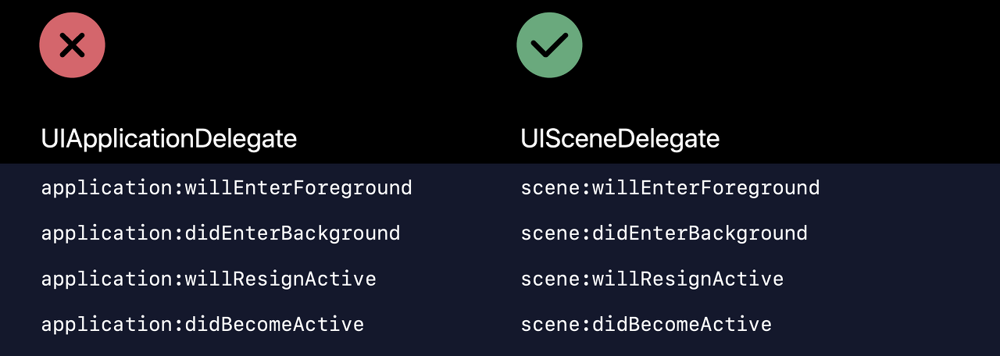
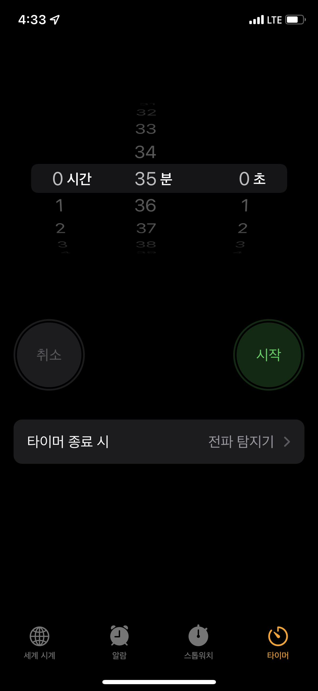

# CheckList

## App Lifecycle
iOS 앱은 상태 변화를 아래 속성별로 구분한다.
>Refernece 꼼꼼한 재은씨의 스위프트 기본편
- Not Running : 앱이 시작되지 않았거나 실행되었짐나 시스템에 의해 종료된 상태를 나타낸다.
- Inactive : 앱이 전면에서 실행 중이지만, 아무런 이벤트를 받지 않고 있는 상태를 나타낸다.
- Active: 앱이 전면에서 실행 중이며, 이벤트를 받고 있는 상태
- Background : 앱이 백그라운드에 있지만 여전히 코드가 실행되고 있는 상태, 대부분의 앱은 Suspended 상태로 이행하는 도중에 일시적으로 진입하지만, 파일 다운로드나 업로드, 연산처리 등 여분의ㅣ 실행 시간이 필요한 앱일 경우 특정 시간 동안 이 상태로 남아 있게 되는 경우도 있다.
- Suspended : 앱이 메모리에 유지되지만 실행되는 코드가 없는 상태. 메모리가 부족한 상황이 오면 iOS 시스템은 foreground에 있는 앱의 여유 메모리 공간을 확보하기 위해 Suspended 상태에 있는 앱들을 특별한 알림 없이 정리한다.

앱의 실행 상태가 변화할 때마다 앱 객체는 앱 델리게이트에 정의된 특정 메소드를 호출한다. 이를 통해서 앱이 백그라운드에 돌입하는 시점에 데이터를 저장하거나 앱이 액티브 될 때 뷰를 업데이트 하는 등의 동작을 수행할 수 있다.

iOS 13.0 이전에 SceneDelegate가 도입되기 전에 위의 작업은 AppDelegate에서 수행되었지만 이제는 대부분의 메소드가 Scene Delegate로 이동했다. 

[WWDC 2019 Architecting Your App for Multiple Windows](https://developer.apple.com/videos/play/wwdc2019/258/)
>Reference Jake Yeon

[위 WWDC 영상 정리 블로그 글](https://velog.io/@minni/Architecting-your-app-for-multiple-windows)

## Mac Catalyst
Mac Catalyst는 iPad용도로 출시된 앱을 MacOS에서도 사용 가능할수 있게 해주는 프로젝트이다.
M1칩의 Apple Device들이 나오고 SwiftUI가 이를 크로스 플랫폼(Android와 iOS간 그런 크로스 플랫폼이 아님)으로 지원하면서 iOS, iPadOS, MacOS 등 통합할 수 있게 되었지만 여전히 Intel 기반의 맥 디바이스는 유효하다.
[Developer Apple Mac Catalyst Tutorials](https://developer.apple.com/tutorials/mac-catalyst)

>Refernece [Kim Kihyun](https://velog.io/@wimes/Catalyst%EC%99%80-SwiftUI)

맥 카탈리스트는 WWDC 2019에서 발표한 프로젝트로 좀더 구체적으로 얘기하면 UIKit 및 Foundation 코드를 이용하여 MacOS 에서 실행되는 앱을 컴파일 할 수 있는 프로젝트이다.

[WWDC2019 Introducing iPad Apps for Mac](https://developer.apple.com/videos/play/wwdc2019/205/)
- 관련 영상도 위 링크에서 확인해야함

지금단계에서는 SwiftUI 를 통해서 이 대통합이 개발자 입장에서 간편하고 쉽게 이루어졌다는 것

## Cocoa Touch Framework

>Reference 꼼꼰한 재은 씨의 스위프트 기본편 88p

코코아 터치 프레임워크는 애플 환경에서 터치 기반의 애플리케이션을 제작하기 위한 도구들의 모음 
iOS 앱 개발시 처음 속하게 되는 UIKit이 바로 이 Cocoa Touch Framework의 하위 프레임 워크이다. 아래는 대표적인 하위 프레임 워크
- Foundation : 애플리케이션의 핵심 객체와 네트워크, 문자열 처리등의 기능
- UIKit : 앱 개발에 사용되는 유저 인터페이스를 제공하는 기능
- GameKit : 게임 실행 시 게임센터를 연결하거나 근거리 통신을 제공하는 프레임 워크
- MapKit : 위치 정보, 지도 관련서비스를 이용할 수 있는 프레임 워크
- WebKit : 웹 관련 기능을 구현하기 위한 프레임 워크
- UserNotification : 사용자 알림을 처리하기 위한 기능을 제공하는 프레임워크

코코아 터치 프레임워크는 더 다양한 것들이 있고 이들 모두 흥미롭고 재미있는 도구들이다.
코코아 터치 프레임워크는 코코아 프레임워크를 만들어진 것으로 macOS에서 프로그램을 만들기 위해 제작된 것이 코코아 프레임워크 이고 코코아 터치 프레임워크는 이름에도 알 수 있듯이 터치 기반 디바이스에서 개발하기 위해 파생된 프레임워크이다. 둘은 완전히 동일하지는 않지만 많은 기능을 공유하고 있다.

### 프레임워크 계층 관계
각 프레임워크들은 프로그래밍 언어처럼 생산성이 높은 상위 프레임워크(계층 스택의 상단으로 상위에 위치할 수록 개발과 접근이 쉽다.)와 로우 레벨 언어 와 같은 하위 프레임워크로 구성이 되어있다. 

iOS에서 프레임워크의 계층 구조는 다음 과 같다.
- Cocoa Touch : UIKit을 포함하는 프레임워크
- Media : 그래픽, 미디어 등 멀티미디어 서비스를 제공, 음악, 비디오 등을 찾고 재생하는 계층, 대표적으로 AVFoundation
- Core Service : 중력 가속도센서, 조도센서, 자이로스코프 와 같은 하드웨어 특성에 기반한 서비스 제공, MapKit와 자주 활용되는 CoreLocation이 이 계층이 해당된다.
- Core OS : C기반 저수순 API로 하드웨어와 가장 가까운 최하위 계층, 커널, 네트워크, 파일 접근, 보안 , 전원 관리와 같은 핵심 영역

## ViewController 
앱의 뷰 계층을 관리하는 객체로  앱 작성시 대부분의 뷰 컨트롤러들은 각자가 하나씩의 화면을 담당아혀 콘텐츠를 표현하고 뷰를 관리한다. 이를 씬(Scene)이라는 용어로 부른다. 씬이 2개가 있다고 하면 뷰 컨트롤러가 2개가 필요하다는 의미로 해석할 수 있다. 

뷰 컨트롤러는 목적에 따라 좀더 세분화 할 수 있다.
- View Controller : 가장 기본이 되는 View Controller로 앱의 데이터와 표시될 외형을 연결해서 하나의 동적 화면을 만들어 내는 컨트롤러이다. 해당 뷰 컨트롤러는 반드시 UIViewController 클래스를 상속받는다.

- Navigation Controller : 앱의 화면 이동에 대해 관리와 처리를 담당하는 컨트롤러로 다른 뷰 컨트롤러를 호함하는 개념이기도 하다. 대부분의 어플리케이션이 하나의 앱 안에서 시작을 하는 화면에서부터 이동해서 특정 기능을 사용하는 화면으로 넘어가는데 아마 대부분이 이 네비게이션 컨트롤러의 기능을 이용한 것이다.

- Table View Controller : 연락처나 채팅앱의 대화목록 과 같이 한 줄에 하나씩 여러줄에 걽쳐 같은 목적의 데이터를 나열하는게 Table View Controller의 역할이다. 테이블 뷰 컨트롤러는 내부에 테이블 뷰와 또 그 내부에 뷰 셀을 가지고 있고 셀을 반복해서 보여준다.

- Collection View Controller : Table View와 갈래를 같이하는 뷰컨트롤러로 흔히 사진앱이나, 인스타그램과 같은 어플을 Collection View를 통해 구현할 수 있다. 어플이 유저 인터페이스가 굉장히 인터렉티브 하고 복잡해질 때 이를 작성하고 관리할 수 있는 고성능의 뷰 컨트롤러이다.

- Tab bar Controller
탭 바 컨트롤러는 화면을 나타내는 여러개의 탭이 있고 탭을 터치하면 화면이 전환되는 형태의 뷰 컨트롤러이다. 

## UIView
UIView는 화면의 직사각형 영역에 대한 내용을 관리하는 객체로 UIView 클래스는 모든 View의 공통적인 기본 빌딩 블록이다. 무슨소린고 하니
UIButton, UILable 등과 같은 객체들은 모두 UIView의 자식 뷰들이다.
또 UIView는 다른 UIView 하위 객체들을 subView에 포함할 수 있으며 같은 UIView조차도 포함할 수 있다.
[Developoer Apple UIView Document](https://developer.apple.com/documentation/uikit/uiview)

### UIView의 위치와 크기
UIView의 위치는 frame과 center로 접근할 수 있는데 center는 UIView의 중심좌표를 컨트롤 하므로 용도에 맞게 사용할 수 있다.

## @IBOutlet, @IBAction
IB접두어에 어노테이션이 붙어있는 이것들은 각각 속성과 메소드를 의미한다. 이는 컴파일러에게 알려주기 위한 용도이다.
IB는 InterfaceBuilder의 약어이다.

## Break Point
내용이 길어서 별도의 문서로 작성함 [이동하기](DebugAndBraekPoint.md)