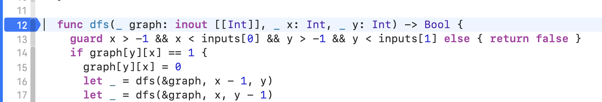
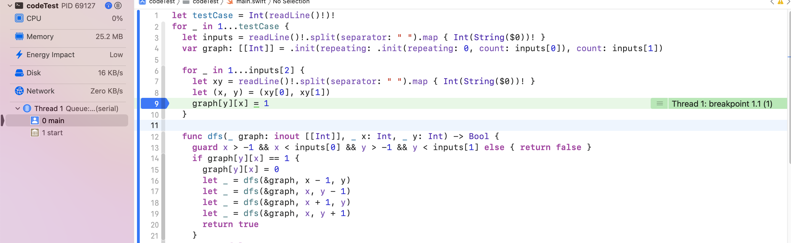
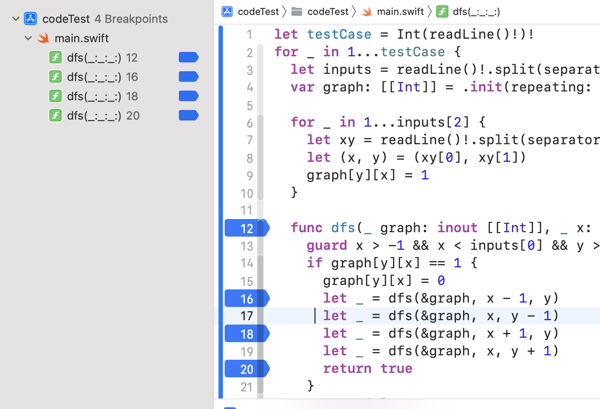
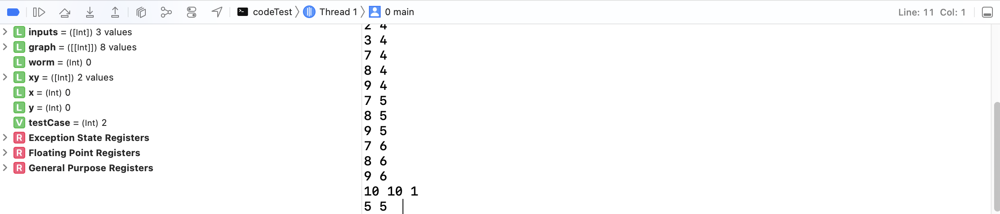
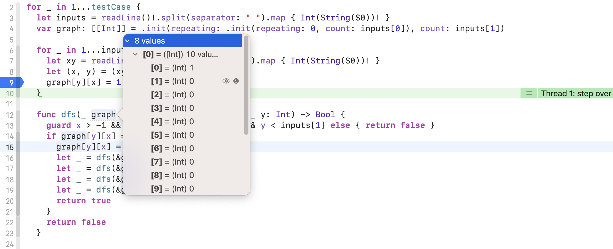
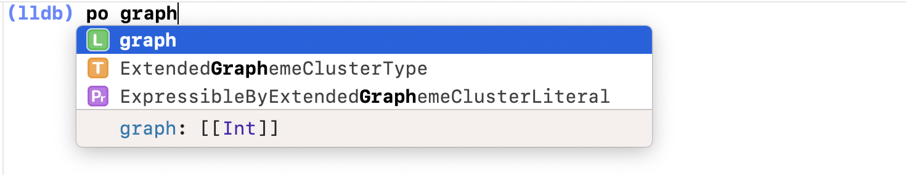
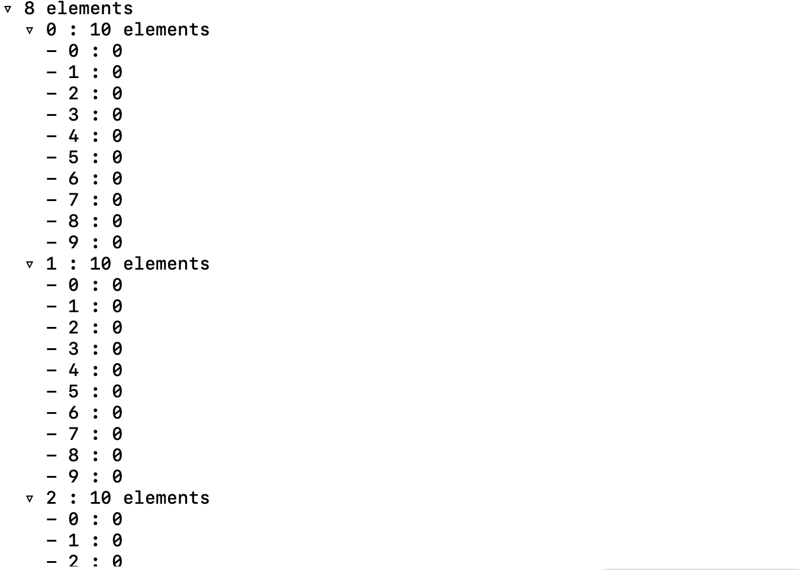
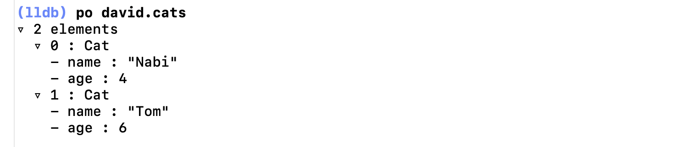
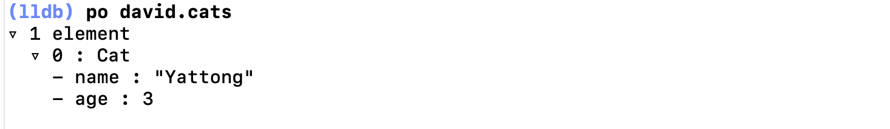
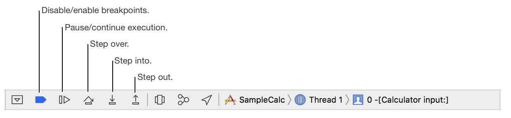

# 디버그와 브레이크 포인트

## Index
- [BreakPoint](#breakpoint)
- [변수 등 상태값 디버깅, 모니터링](#변수-등-상태값-디버깅-모니터링)
- [Debug Bar Button](#debug-bar-button)

## BreakPoint
BreakPoint는 Xcode 상에서 거터 레인을 클릭했을때 나타나는 파란색 화살표를 말한다.<br>

이는 디버그 모드 상태에서 앱을 실행할 때 프로그램이 해당 라인을 실행할 때 거기서 잠깐 멈추라는 중단점을 설정해 준다.
디버깅 목적으로 아주 유용하게 사용할 수 있다.

*어플이 실행중 브레이크포인트에 걸린 모습 초록색 라인으로 표시된다.* 



거터를 클릭해서 마우스를 통해 Break Point를 지정할 수도 있고, 해당 라인에서 Command+\를 단축키를 통해 브레이크 포인트를 등록할 수 있다.

가끔 앱의 구성이 복잡해지고 파일이 많아져서 어딘가에 브레이크 포인트를 지정하고 까먹고 앱을 실행했는데 의도치 않게 브레이크 포인트에 걸리는 경우도 있고 너무 많이 걸어놔서 이걸 일일이 찾아다녀서 제거해야 하는 상황도 있다.

브레이크포인트는 BreakNavigator 에서 관리하기 때문에 해당 네비게이터로 가면 한눈에 이들을 관리하고 삭제할 수 있다.



## 변수 등 상태값 디버깅 모니터링

이러한 브레이크포인트에 걸린 상태에서 여러 상태값들을 디버깅이 가능하다.

콘솔 왼쪽에 디버그 에리어를 보면 현재 지정한 변수들에 어떠한 값이 들어가있는지 모니터링을 할 수도 있고


변수 이름에 마우스 포인터를 가져다 가면 직관적으로 현재값을 표시해주기도 한다.

이번에는 코드로 원하는 개체를 모니터링 할 수 있는 방법으로 lldb command를 이용하는 방법이다.
브레이크 포인트로 멈춘 상태에서 콘솔 영역을 보면 (lldb)라고 표시가 되어있는데


만약 lldb가 보이지 않으면 바로 아래에 All Output을 Debugger Output으로 바꿔보자 그럼 뿅하고 생긴다.
이 상태에서 나는 지금 graph 개체에 들어가있는 값을 확인하고 싶다 그러면 po 커멘드를 활용할 수 있다.


(자동완성도 되는 친절함)
그러면 편리하게도 나의 경우 이중 정수 배열로 각 배열의 count와 인덱스, 요소를 깔끔하게 표시해준다


객체를 들여다 보는 것에도 유용한데
아래와 같은 코드가 있다고 가정
```Swift
struct Cat {
  var name: String
  var age: Int
}

class People {
  var cats: [Cat]
  
  init(cats: [Cat] = []) {
    self.cats = cats
  }
  
  func addCat(cat: Cat) {
    cats.append(cat)
  }
  
}

let nabi = Cat(name: "Nabi", age: 4)
let tom = Cat(name: "Tom", age: 6)
let moo = Cat(name: "Moo", age: 3)


var david = People()

[nabi, tom, moo].forEach { cat in
  david.addCat(cat: cat) //break point!
}
```
간략하게 설명하면 고양이 객체와 고양이를 기르는 사람 클래스가 있고 3마리의 고양이와 한명의 사람을 인스턴스화 했다.
그리고 고양이 셋을 사람에게 소유시키는데 추가하는 부분에 브레이크 포인트를 걸고 두어번 스텝을 진행시킨디 lldb에 `po david.cats`로 타이핑 해보자. 그러면 이 요소에 대해서 자세히 보여준다.
print를 쳐가면서 디버깅 하지 않아도 되니 완전 좋다.



그다음 유용한 것은 expr(expression)인데 디버깅 중에 새로운 변수를 추가하거나 기존 변수를 변경할 수 있다.
위 코드에서 nabi를 var로 변경하고 브레이크 포인트를 tom을 할당하는 이후에 잡아보자.
그리고 lldb에 `expr nabi.name = "Chease"` 로 타이핑 한뒤
`po nabi`를 다시 입력해 보면 nabi의 이름이 Chease로 변경된 것을 볼 수 있다.

또 글로별 변수를 생성할 수도 있다.

브레이크 포인트를 david 인스턴스가 생성된 다음 줄에 찍은 뒤
lldb에 다음과 같이 입력해 보자
```Swift
expr let $yattong = Cat(name: "Yattong", age: 3)
expr david.addCat(cat: $yattong)
po david.cats
```

입력결과로 david가 가진 고양이 목록에 야통이가 추가된 것을 볼 수 있다! (얏홍!)



## Debug Bar Button


그 다음은 디버그 바에 대한 설명이다.


각자 설명해 보자면
- Disable/enable breakpoints : 브레이크 포인트들을 일괄로 비활성화/활성화 할 수 있다.
- Pause/continue excution : 다음 브레이크 포인트가 나올때 까지 진행한다.
- Step over : 브레이크 포인트의 다음 라인으로 넘어가겠다.
- Step into : 함수 호출시 앱이 중지된 경우 이 기능ㅇ로 함수 내부로 들어가서 함수를 상세하게 진행할 수 있다.
- Step out : 함수를 나간다.

각 기능들을 직접 조작해보는 것이 어떠한 기능인지 빠르게 와닿을 것이다. 코드가 1000줄을 넘어가는데 Step over만 누르고 있는 상황은 없도록 하자(.)