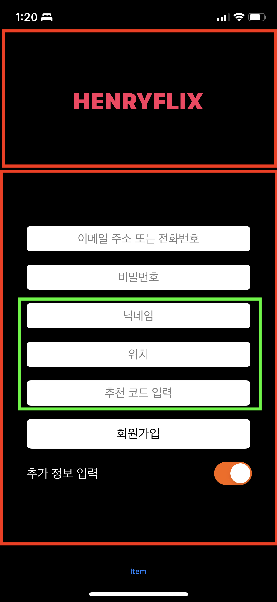

# Netflix Clone Coding

- [레이아웃 구성](#레이아웃-구성)
- [코드](#코드)
- [textField 플레이스홀더 텍스트 색 바꾸기](#textfield-플레이스홀더-텍스트-색-바꾸기)
- [뷰 isHidden 애니메이션 추가](#뷰-ishidden-애니메이션-추가)
- [키보드 show/hide 마다 뷰 위치 변경하기](#키보드-show-hide-마다-뷰-위치-변경하기)
- [textField에서 return 키를 눌러서 다음 텍스트필드로 이동하기](#textfield에서-return-키를-눌러서-다음-텍스트필드로-이동하기)
- [회원가입 정보입력 검증하기](#회원가입-정보입력-검증하기)

## Netflix SignUp Page

요로코롬 회원가입 화면을 구현하는 것이 목표

### 레이아웃 구성
<br>
상단의 타이틀 로고는 그냥 레이블 이며
정보입력 칸은 모두 textFeild이다. 스택뷰로 모두 감쌌으며 여기서 닉네임, 위치, 추천 코드 입력은 추가 정보 입력 스위치를 토글했을 때 한꺼번에 사라지므로 걔네만 스택뷰로 한번 더 묶었다.


### 코드
`LoginViewController.swift`
```Swift
import UIKit

class LoginViewController: UIViewController {
  
  @IBOutlet weak var emailOrNumberLable: UITextField!
  @IBOutlet weak var passwordLabel: UITextField!
  @IBOutlet weak var nicknameLabel: UITextField!
  @IBOutlet weak var locationLabel: UITextField!
  @IBOutlet weak var recomendCode: UITextField!
  @IBOutlet weak var signUpButton: UIButton!
  @IBOutlet weak var detailInformationStackView: UIStackView!
  @IBOutlet weak var detailInfoSwitch: UISwitch!
  
  override func viewDidLoad() {
    super.viewDidLoad()
    
    NotificationCenter.default.addObserver(self, selector: #selector(keyboardWillShow(notification:)), name: UIResponder.keyboardWillShowNotification, object: nil)
    NotificationCenter.default.addObserver(self, selector: #selector(keyboardWillHide(notification:)), name: UIResponder.keyboardWillHideNotification, object: nil)
    
    [emailOrNumberLable, passwordLabel, nicknameLabel, locationLabel, recomendCode].forEach { textField in
      textField?.text = ""
      textField?.textColor = .black
      textField?.setPlaceholderColor(.gray)
      textField?.textAlignment = .center
      textField?.borderStyle = .roundedRect
      textField?.backgroundColor = .white
      textField?.delegate = self
    }
    
    passwordLabel.isSecureTextEntry = true
    recomendCode.keyboardType = .numberPad
    
    detailInfoSwitch.isOn = true
    detailInfoSwitch.tintColor = .orange
    
    let transition = CATransition()
    transition.type = .fade
    transition.duration = 0.2
    transition.timingFunction = CAMediaTimingFunction(name: .easeInEaseOut)
    detailInformationStackView.layer.add(transition, forKey: nil)
    
  }
  
  //MARK: - IBAction
  @IBAction func tappedSignUpButton() {
    //    guard let controller = storyboard?.instantiateViewController(withIdentifier: "MainCollectionVIewController") as? MainCollectionViewController else { return }
    //    navigationController?.pushViewController(controller, animated: true)
    if emailOrNumberLable.text!.isEmpty || passwordLabel.text!.isEmpty {
      let alert = UIAlertController(title: "입력", message: "필수 항목을 입력해주세요", preferredStyle: .alert)
      let ok = UIAlertAction(title: "확인", style: .default, handler: nil)
      alert.addAction(ok)
      present(alert, animated: true, completion: nil)
    } else {
      if isValidEmail(for: emailOrNumberLable.text!) || isValidPhoneNumber(for: emailOrNumberLable.text! ){
        print("""
              ID: \(emailOrNumberLable.text!)
              PW: \(passwordLabel.text!)
              NICK: \(nicknameLabel.text!)
              LOCATION: \(locationLabel.text!)
              CODE: \(recomendCode.text!)
              """)
        
        [emailOrNumberLable, passwordLabel, nicknameLabel, locationLabel, recomendCode].forEach { textField in
          textField?.text = ""
        }
        
      } else {
        let alert = UIAlertController(title: "입력", message: "올바른 형식의 이메일 또는 전화번호가 아닙니다", preferredStyle: .alert)
        let ok = UIAlertAction(title: "확인", style: .default, handler: nil)
        alert.addAction(ok)
        present(alert, animated: true, completion: nil)
      }
    }
  }
  
  private func isValidEmail(for email: String) -> Bool {
    let emailRegEx = "[A-Z0-9a-z._%+-]+@[A-Za-z0-9.-]+\\.[A-Za-z]{2,64}"
    let emailTest = NSPredicate(format:"SELF MATCHES %@", emailRegEx)
    return emailTest.evaluate(with: email)
  }
  
  private func isValidPhoneNumber(for number: String) -> Bool {
    let phoneRegex = "^\\d{3}-\\d{4}-\\d{4}$"
    let phoneTest = NSPredicate(format: "SELF MATCHES %@", phoneRegex)
  let result = phoneTest.evaluate(with: number)
    return result
  }
  
  private func isValidPassword(for pasword: String) -> Bool {
    pasword.count > 5
  }
  
  private func isValidRecomendCode(for code: String) -> Bool {
    return Int(code) != nil
  }
  
  @IBAction func detailInformationViewSwitch(_ sender: UISwitch) {
    detailInformationStackView.isHidden = !sender.isOn
  }
  
  //MARK: - Helper
  @objc private func keyboardWillShow(notification: NSNotification) {
    if let keyboardSize = (notification.userInfo?[UIResponder.keyboardFrameEndUserInfoKey] as? NSValue)?.cgRectValue {
      if self.view.frame.origin.y == 0 {
        self.view.frame.origin.y -= keyboardSize.height - 100
      }
    }
  }
  
  @objc private func keyboardWillHide(notification: NSNotification) {
    if self.view.frame.origin.y != 0 {
      self.view.frame.origin.y = 0
    }
  }
}

extension LoginViewController: UITextFieldDelegate {
  func textFieldShouldReturn(_ textField: UITextField) -> Bool {
    if emailOrNumberLable.isFirstResponder {
      
      passwordLabel.becomeFirstResponder()
    } else if passwordLabel.isFirstResponder {
      
      if detailInfoSwitch.isOn {
        nicknameLabel.becomeFirstResponder()
      } else {
        passwordLabel.resignFirstResponder()
        tappedSignUpButton()
        
      }
    } else if nicknameLabel.isFirstResponder {
      
      recomendCode.becomeFirstResponder()
    } else if locationLabel.isFirstResponder {
      
      recomendCode.becomeFirstResponder()
    } else if recomendCode.isFirstResponder {
      recomendCode.resignFirstResponder()
      tappedSignUpButton()
    }
    return true
  }
}
```
내용이 꽤 길다.

### textField 플레이스홀더 텍스트 색 바꾸기
우선 처음 고민했던 것은 textField의 플레이스홀더 텍스트 색을 바꾸는 일인데
UITextField의 확장 메소드로 해결했다. 스택오버플로우에서 찾음 ㅎㅎ
```Swift
public extension UITextField {
  
  func setPlaceholderColor(_ placeholderColor: UIColor) {
    attributedPlaceholder = NSAttributedString(
      string: placeholder ?? "",
      attributes: [
        .foregroundColor: placeholderColor,
        .font: font
      ].compactMapValues { $0 }
    )
  }
}
```

### 뷰 isHidden 애니메이션 추가
그 다음은 추가 정보 입력 토글 스위치를 오프 했을 때 필수항목들이 아닌 닉네임, 위치, 추천코드 입력 필드가 사라지는 건데, 그냥 사라지는 것 보다 애니메이션을 추가 하고 싶었다.

해당 스위치 IBAction에서는 isHidden만 토글한다.

viewDidLoad에 다음과 같은 코드를 추가했다.
```Swift
 let transition = CATransition()
    transition.type = .fade
    transition.duration = 0.2
    transition.timingFunction = CAMediaTimingFunction(name: .easeInEaseOut)
    detailInformationStackView.layer.add(transition, forKey: nil)
```

### 키보드 show hide 마다 뷰 위치 변경하기
화면에 입력 필드가 많아서 텍스트 필드를 눌렀을 때 키보드가 올라오면 필드가 키보드에 가려준다
그래서 키보드에 가려진 만큼 전체 뷰를 위로 이동시킨다.
```Swift
ovveride func viewDidLoad {
  super.viewDidLoad()
 NotificationCenter.default.addObserver(self, selector: #selector(keyboardWillShow(notification:)), name: UIResponder.keyboardWillShowNotification, object: nil)
    NotificationCenter.default.addObserver(self, selector: #selector(keyboardWillHide(notification:)), name: UIResponder.keyboardWillHideNotification, object: nil)
...
//MARK: - Helper
  @objc private func keyboardWillShow(notification: NSNotification) {
    if let keyboardSize = (notification.userInfo?[UIResponder.keyboardFrameEndUserInfoKey] as? NSValue)?.cgRectValue {
      if self.view.frame.origin.y == 0 {
        self.view.frame.origin.y -= keyboardSize.height - 100
      }
    }
  }
  
  @objc private func keyboardWillHide(notification: NSNotification) {
    if self.view.frame.origin.y != 0 {
      self.view.frame.origin.y = 0
    }
  }
```
키보드 리스폰더를 노티피케이션 센터에서 검출하고 셀렉터 액션으로 프레임 센터축을 옮겼다.

### textField에서 return 키를 눌러서 다음 텍스트필드로 이동하기
```Swift
extension LoginViewController: UITextFieldDelegate {
  func textFieldShouldReturn(_ textField: UITextField) -> Bool {
    if emailOrNumberLable.isFirstResponder {
      
      passwordLabel.becomeFirstResponder()
    } else if passwordLabel.isFirstResponder {
      
      if detailInfoSwitch.isOn {
        nicknameLabel.becomeFirstResponder()
      } else {
        passwordLabel.resignFirstResponder()
        tappedSignUpButton()
        
      }
    } else if nicknameLabel.isFirstResponder {
      
      recomendCode.becomeFirstResponder()
    } else if locationLabel.isFirstResponder {
      
      recomendCode.becomeFirstResponder()
    } else if recomendCode.isFirstResponder {
      recomendCode.resignFirstResponder()
      tappedSignUpButton()
    } else {
      textField.resignFirstResponder()
    }
    return true
  }
}
```

### 회원가입 정보입력 검증하기
```Swift
//MARK: - IBAction
  @IBAction func tappedSignUpButton() {
    //    guard let controller = storyboard?.instantiateViewController(withIdentifier: "MainCollectionVIewController") as? MainCollectionViewController else { return }
    //    navigationController?.pushViewController(controller, animated: true)
    if emailOrNumberLable.text!.isEmpty || passwordLabel.text!.isEmpty {
      let alert = UIAlertController(title: "입력", message: "필수 항목을 입력해주세요", preferredStyle: .alert)
      let ok = UIAlertAction(title: "확인", style: .default, handler: nil)
      alert.addAction(ok)
      present(alert, animated: true, completion: nil)
    } else {
      if isValidEmail(for: emailOrNumberLable.text!) || isValidPhoneNumber(for: emailOrNumberLable.text! ){
        print("""
              ID: \(emailOrNumberLable.text!)
              PW: \(passwordLabel.text!)
              NICK: \(nicknameLabel.text!)
              LOCATION: \(locationLabel.text!)
              CODE: \(recomendCode.text!)
              """)
        
        [emailOrNumberLable, passwordLabel, nicknameLabel, locationLabel, recomendCode].forEach { textField in
          textField?.text = ""
        }
        
      } else {
        let alert = UIAlertController(title: "입력", message: "올바른 형식의 이메일 또는 전화번호가 아닙니다", preferredStyle: .alert)
        let ok = UIAlertAction(title: "확인", style: .default, handler: nil)
        alert.addAction(ok)
        present(alert, animated: true, completion: nil)
      }
    }
  }
  
  private func isValidEmail(for email: String) -> Bool {
    let emailRegEx = "[A-Z0-9a-z._%+-]+@[A-Za-z0-9.-]+\\.[A-Za-z]{2,64}"
    let emailTest = NSPredicate(format:"SELF MATCHES %@", emailRegEx)
    return emailTest.evaluate(with: email)
  }
  
  private func isValidPhoneNumber(for number: String) -> Bool {
    let phoneRegex = "^\\d{3}-\\d{4}-\\d{4}$"
    let phoneTest = NSPredicate(format: "SELF MATCHES %@", phoneRegex)
  let result = phoneTest.evaluate(with: number)
    return result
  }
  
  private func isValidPassword(for pasword: String) -> Bool {
    pasword.count > 5
  }
  
  private func isValidRecomendCode(for code: String) -> Bool {
    return Int(code) != nil
  }
```