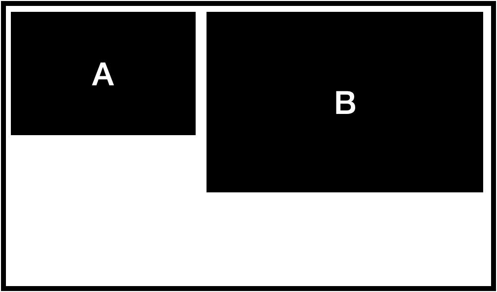
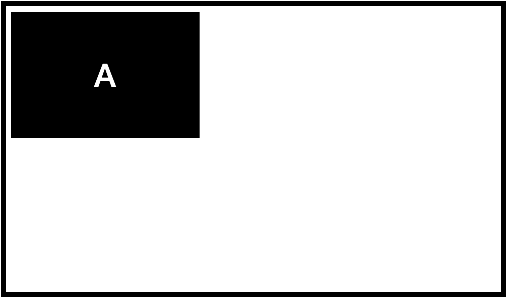

# 1001 Checklist

# Index

- OPEN

# Function vs Method

메소드는 객체 내의 멤버로 사용되는 함수를 의미한다. - [HackingWithSwift](https://www.hackingwithswift.com/quick-start/understanding-swift/whats-the-difference-between-a-function-and-a-method)

# Parameter vs Argument

Parameter는 매개변수로 번역되며 Argument는 인자이다.둘의 용어의 차이는 비슷하지만 다른데 함수는 Parameter 목록을 가지고 있다.

```
func foo(p1: Int, p2: Int) {}
```

foo function은 p1, p2를 매개변수를 가지고 있다. 즉 괄호 안에 있는게 매개변수 리스트라고 보면 된다.

반면 인자는 함수를 호출할때 매개변수 리스트에 전달하는 값을 의미한다. 쉽게 말하자면 매개변수는 함수가 가지는 것, 함수 내부의 것이고 인자는 함수를 호출할때 전달하는 개체인 것이다.

# Parameter Name vs Argument Lable

이름으로 오면 그 의미가 좀더 명확해 지는데 Parameter Name은 함수 내부에서 활용하는 매개변수의 이름으로 함수 내부에서는 그 매개변수를 해당 이름으로 호출한다.

```
func foo(p1: Int, p2: Int) {
  print(p1 + p2)
}
```

p1과 p2가 각각 매개변수의 이름 되시겠다. 반면 Argument Label는 외부에서 함수를 호출할때 인자를 전달하기 위한 이름으로

함수 외부에서는 그 Argument Label로 해당 개채를 칭한다.

```
func foo(num1 p1: Int, num2 p2: Int) {
  print(p1 + p2)
}
let foov1 = 1
let foov2 = 2

foo(num1: foov1, num2: foov2)
//3
```

num1과 num2가 각각 Argument Labels가 되겠다 함수 밖에서도 함수를 호출하면서 num1이라는 Argument Label에 foov1 라는 Argument를 전달한다.

# Wildcard Pattern

Wildcard Pattern은 사용하지 않는 값에 대해서 사용할 수 있는 패턴이다. 예를들어

```
let a = "Hello Swift"
```

a라는 상수를 사용하지 않는다면 a를 어디서도 호출할 필요가 없으므로 이름을 필요로 하지 않느다.

```
let _ = "Hello Swift"
```

로 사용할 수 있다. 다양한 상황에서 사용되는데 Argument Label을 생략하고 싶은 경우, 스위치 문에서 튜플 중 하나만 값을 체크하고 싶은 경우 등에서 쓸 수 있다.

# Override vs Overload

오버라이드는 메소드나 함수를 재정의 하는 것을 말한다. 예를들어

```
class Person {
  let firstName: String
  let lastName: String
  init(firstName: String, lastName: String) {
    self.firstName = firstName
    self.lastName = lastName
  }

  func fullName() -> String {
    "\(firstName) \(lastName)"
  }
}

class Korean: Person {
  override func fullName() -> String {
    "\(lastName firstName)"
  }
}
```

영어권에서는 이름을 firstName, 성을 lastName으로 이름, 성 순으로 부르지만 한국인은 성, 이름 순으로 이름을 부른다. 한국인 클래스에서는 fullName을 호출하는 동작을 바꾸고 싶기때문에 수퍼클래스에서 받아온 메서드를 재정의 했다. 이럴때 쓰는 것이 바로 메소드 재정의에 해당된다.

## Overload

오버로드는 직역하면 과부하 인데 딱히 함수가 과부하 되었다는 뜻은 아니고 같은 이름을 가진 함수를 여러개 선언할 수 있는 것을 뜻한다.

```
func sum(lhs: Int, rhs: Int) -> Int {}
func sum(rhs: Double, rhs: Double) -> Double {}
```

두 함수는 동일한 sum함수로 매개변수 타입과 리턴타입이 다르다. 이런 경우 사용자 입장에서는 두 함수가 타입에 대한 대응만 달리할뿐 동일한 결과를 내는 함수라는 것을 직관적으로 알 수 있다. 이게 가장 중요한 포인트

다만 함수 오버로딩에서 규칙이 있는데 명확하게 구분이 되지 않는 경우는 에러가 발생하게 된다.

```
func sum(lhs: Int, rhs: Int) -> Int {}
func sum(lhs: Int, rhs: Int) -> Double {}
```

이런 경우는 두 함수가 다른 타입에 대해서 대응하는 기능을 나누어 두긴 했지만 호출하는 입장에서는 두 함수가 구분이 안된다. 컴파일러가 어느 함수를 호출해야 할지 모호한 상황이 되는 것이다.

# AutoLayout, Constraints

> Reference Auto Layout by Tutorials UI를 구성할 때 예를들어 iPhone 13 mini를 기준으로 화면을 구성했다고 하자, 그러면 구현한 UI가 iPhone SE나 , iPhoneXR 등에서도 똑같이 보일까? 다른 디바이스에서 iPhone 13 mini에서 디자인한 UI를 똑같이 보려면 각 디바이스마다 별도로 디자인을 해주어야 할까? 과거에는 디바이스의 종류가 적어서 충분히 가능했을 법한 일이지만 지금 현역으로 쓰는 디바이스만 해도 극단적으로 iPhone 6부터 iPhone 13 Pro Max 까지 이들 디바이스의 화면 크기가 모두 다르다.
> 

더 나아가서 화면을 가로모드로 돌렸을 때 UI대응을 생각하면 작업량이 2배, 거기다가 iPad에서도 대응하도록 만든다면?

그래서 있는 개념이 바로 AutoLayout이다. 이것은 한번의 UI작업으로 모든 디바이스와 화면 구성에 대응할 수 있도록 한다.

## AutoLayout 시작하기

오토 레이아웃은 이름은 오토이긴 하지만 자동으로 수행되지는 않는다.(웃음) 오토 레이아웃에는 다음과 같은 개념이 있다. 1. 오토레이아웃으로 생각하기 2. Dynamically sizing `UITableViewCell` / `UICollectionViewCell` 3. UIStackView와 오토 레이아웃을 이용한 제약조건 최소화 4. Constraint content hugging과 Compression resistance priorities 5. Constructing Auto Layout programmatically(코드를 이용한 오토레이아웃 제약조건)

## UIView와 View Hierarchy

UIView는 UIKit에서 모든 UI의 베이스로 UILabel, UIButton 모두 UIView에 속한다. [읽어보기](https://github.com/urijan44/SSAC-Task/blob/master/0929/Checklist.md#uiview)

앱의 View는 계층구조로 정렬되며 각 뷰는 상위 뷰에 포함되고 또 하나 이상의 뷰가 포함될 수 있다. 상위 뷰는 `Superview` 칭한다.

## Autolayout 입장으로 생각하기

오토 레이아웃은 화면에서 UI를 구성시 `상대`적으로 구현한다. 이게 핵심이다. 오토레이아웃을 작업하는 현재 뷰는 수퍼뷰 라는 캔버스위에 작업 중이라는 것을 명심해야 한다.

오토레이아웃으로 작업할 때 다음과 같은 사고를 병행하면 도움이 된다. #### 뷰의 위치 관점 1. 다른 뷰와 비교해서 볼때 지금 뷰의 위치 2. 수퍼뷰가 커지거나 줄어들면 뷰의 위치가 변경되는지, 변경되는 것에 패턴이 있는지? 3. 뷰의 내용이 정적인지, 동적인지? 동적인 콘텐츠의 경우 커지거나 줄어들 때 보기의 위치를 어떻게 지정할 것인지? 4. 뷰가 다른 뷰에 대해 얼마나 멀리 또는 가까이 있는지, 가까이에 있다면 최소 거리는 또 몇인지? #### 뷰의 크기 관점 1. 뷰의 크기가 다른 뷰에 대해 상대적인지, 크기가 변하는 거에 대한 규칙이 있는지? 2. 수퍼뷰의 크기에 따라 뷰의 크기도 달라지는지, 규칙지 있는지? 3. 뷰의 콘텐츠가 정적인지, 동적인지 , 동적인 경우 콘텐츠의 크기에 따라 뷰의 크기도 변경되는지? 4. 뷰를 늘리거나 줄일 수 있는 범위에 제한이 있는지?

### 예시



위와 같은 간단한 앱 디자인을 하려고 한다.

먼저 A뷰 부터 고민해보자



A뷰에 대해 앞서 뷰의 위치와 뷰의 관점에 대해서 생각을 차례대로 적용해보자

1. A뷰의 위치는 수퍼뷰의 왼쪽 위 모서리로부터 위로 20p, 왼쪽으로 20p 떨어져있다.
2. A뷰의 크기는 다른 뷰에 대해서 상대적인지? 
    - 상대적이지 않음
3. 수퍼뷰가 커지거나 줄어들면 A뷰의 크기가 변경되는지? 
    - 수퍼뷰의 크기에 무관함
4. A뷰 안의 콘텐츠가 정적인지, 동적인지, 동적인 경우 콘텐츠의 크기에 따라 A의 크기도 변하는지 
    - A뷰는 정적인 사이즈를 가지며 width 200, height 100 포인트이다

뷰의 상수들이 오토레이아웃이 사이즈를 결정하는데 필요한 값들을 모두 주었으므로 이제 뷰B로 넘어가도 된다.

뷰B 오토 레이아웃


1. 뷰B는 다른 뷰와 어떤 관계에 있는지?
    - B의 왼쪽 면전 A의 오른쪽 면에 25포인트 떨어져있고 B의 위쪽 면은 A의 위쪽 면과 동일하게 정렬된다. B의 높이는 A 높이의 1.5 배이다.
2. B의 크기가 다른 뷰의 대해 상대적인지? 조건은 무엇인지
    - 너비와 높이가 상대적이다. 너비의 경우 A의 오른쪽(트레일링) 면과 수퍼뷰의 트레일링 면에서 일정 포인트 떨어져 있고 높이는 A에 대해서 1.5배의 높이이다.

이제 이를 오토레이아웃의 제약조건(Constraints)으로 어떻게 적용할 수 있는지 보자.

## Constraints(제약조건)

오토레이아웃에서 제약조건은 간단한 수학적 계산을 이용해 오토 레이아웃에 전달한다. 제약 조건은 일련의 선형 방정식으로 다음과 같은 방정식으로 구성된다.

**A의 속성은 배율 * B의 속성 + 상수 로 적용된다.**

제약조건을 추가할 때 선형 방정식을 추가하는 것으로 생각해도 된다.

### **Attributes(속성)**

속성은 오토 레이아웃이 두 보기 간의 관계를 생성하는데 사용하는 뷰의 기능으로 속성에는 위치와 크기 두가지 유형이 있다. 위치 속성에는 leading, trailing, tip, bottom edge가 속한다. 크기 속성에는 Width와 Height이 있다.

### **Multiplier(배율)**

배율은 두 항목 속성 간의 관계에 적용할 수 있는 비율로 예를들어 B 뷰가 A뷰의 높이의 두배가 되도록 할 수 있다.

### **Constant(상수)**

상수는 제약 조건에 추가하는 고정 값으로, 예를 들어 A뷰의 leading edge는 수퍼뷰의 leading edge로 부터 20p 떨어져 있다.

오토 레이아웃의 작동 방식에 영향을 미치는 몇 가지 주요 개념이 더 있다. 여기에는 Intrinsic content size와 , Priorities가 있다.

## Intrinsic Content Size(고유 콘텐츠 크기)

고유 콘텐츠 크기는 뷰가 콘텐츠를 기반으로 차지하는 크기로 풍선에 비유해볼 수 있겠다. 아크릴 상자(뷰)안에 풍선에 바람을 많이 넣은 상태, 바람을 빼는 상태를 생각하면 고유 콘텐츠 크기가 이해가 된다. 아크릴 상자 안에서만 풍선의 크기는 결정되며 다른 아크릴 상자와는 전혀 관계가 없다.

## Priorities(우선순위)

오토 레이아웃이 뷰 계층 구조에 적용된 모든 제약조건을 충족할 수 없는 경우가 있다. 이 같은 경우 뷰들 끼리 서로의 제약조건이 충동하는 경우가 있는데 이를 Priorities(우선순위)를 통해 해결할 수 있다.

### **Constraint priority(제약 조건 우선 순위)**

제약 조건 우선 순위는 오토 레이아웃이 충족하기 위해 어떤 제약이 더 중요한지 결정하는 것으로 우선순의는 1에서 1000사이의 값을 사용하여 정의할 수 있다. 우선순위 1~999는 비 필수 사항이며 우선순위 1000은 필수사항이다. 새로운 제약을 추가할 때 기본 제약 우선순위는 1000으로 정의된다.

### **Content Hugging Priorites(콘텐츠 허깅 우선 순위)**

콘텐츠 허깅 우선 순위는 오토 레이아웃이 고유 크기보다 더 크게 늘어나는 뷰를 결정하는데 도움이 된다. 각 뷰에는 가로, 세로 콘텐츠 허깅 우선순위가 있다. 콘텐츠 허깅 우선 순위가 높은 뷰는 늘어나는 것에 대한 저항력을 나타낸다. 허깅 우선순위가 높으면 늘어나기 힘들고 낮을 수록 잘 늘어난다고 보면 된다.

### Compression resistance priorities(압축 저항 우선 순위)

압축 저항 우선 순위는 오토 레이아웃이 고유 콘텐츠 크기보다 작게 축소되는 뷰를 결정하는데 도움이 된다. 각 뷰에는 수평, 수직 압축 저항 우선 순위가 있다. 우선순위가 높을 수록 줄어 드는것에 대한 저향력을 나타낸다. 압축 저항 우선 순위가 높으면 줄어들기 힘들고 낮을 수록 잘 줄어든다고 보면 된다.

각 뷰에는 기본 750의 수평, 수직 압축 저항 우선 순위가 있다. 콘텐츠 허깅 우선 순위와는 달리 모든 뷰 객체는 뷰 타입이나 인스터스화 방법에 관계없이 동일한 기본 압축 저항 우선순위를 갖는다.
