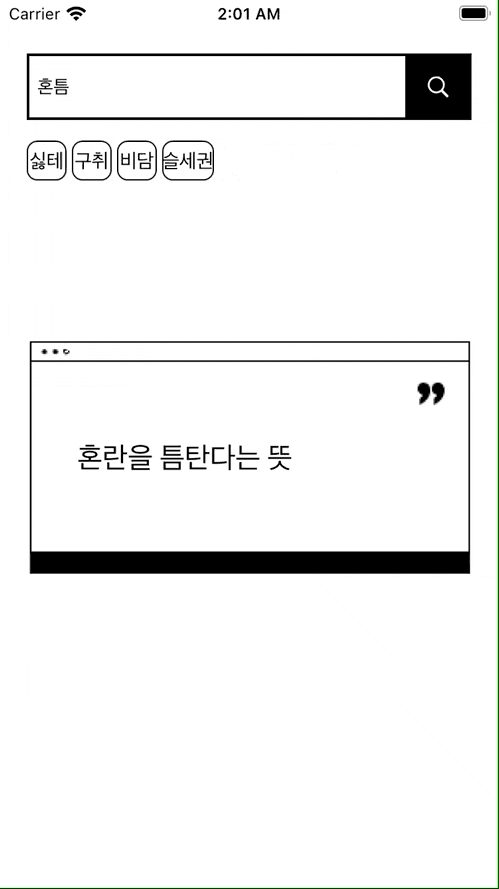

# 신조어 검색기

신조어를 검색하면 뜻을 알려주거나, 무작위로 신조어를 알려드립니다.



특별한 코드는 없으나 iOS15 일때와 이하 버전일 때 버튼의 텍스트 인셋 값이 달라짐, iOS14 이하에서는 버튼의 타이틀 인셋을 주면 텍스트가 잘려보임 titleEdgeInset 말고 contentInset으로 한 뒤 UIButton의 textLable 사이즈 핏으로 button의 프레임에 맞춰주니 해결 됨

```swift
[recomendButton1, recomendButton2, recomendButton3, recomendButton4].forEach { button in
      button?.layer.borderColor = UIColor.black.cgColor
      button?.layer.borderWidth = 1
      button?.layer.cornerRadius = 8
      button?.setTitleColor(.black, for: .normal)
      button?.tintColor = .gray
      button?.titleLabel?.font = UIFont.systemFont(ofSize: 15)
      
      if #available (iOS 15.0, *) {
        
      } else {
        button?.contentEdgeInsets = .init(top: 10, left: 8, bottom: 10, right: 8)
        button?.titleLabel?.sizeThatFits(button!.frame.size)
        button?.sizeToFit()
      }
    }
```

- 전체코드
    - ViewController.swift
        
        ```swift
        //
        //  ViewController.swift
        //  NewlyCoinedWord
        //
        //  Created by hoseung Lee on 2021/10/03.
        //
        
        import UIKit
        
        class ViewController: UIViewController {
        
          @IBOutlet var searchFieldStackView: UIStackView!
          @IBOutlet var searchTextField: UITextField!
          @IBOutlet var searchButton: UIButton!
          @IBOutlet var recomendButtonsStackView: UIStackView!
          @IBOutlet var recomendButton1: UIButton!
          @IBOutlet var recomendButton2: UIButton!
          @IBOutlet var recomendButton3: UIButton!
          @IBOutlet var recomendButton4: UIButton!
          @IBOutlet var descriptionLabel: UILabel!
          
          let data = NCWordStore().ncWords
          
          override func viewDidLoad() {
            super.viewDidLoad()
            
            //Search Field UI
            searchTextField?.borderStyle = .none
            searchFieldStackView.layer.borderWidth = 2
            searchFieldStackView.layer.borderColor = UIColor.black.cgColor
            searchTextField.attributedPlaceholder = .init(string: "신조어 검색")
            searchTextField.delegate = self
            
            //recomendButtons
            recomendButtonsStackView.spacing = 4
            [recomendButton1, recomendButton2, recomendButton3, recomendButton4].forEach { button in
              button?.layer.borderColor = UIColor.black.cgColor
              button?.layer.borderWidth = 1
              button?.layer.cornerRadius = 8
              button?.setTitleColor(.black, for: .normal)
              button?.tintColor = .gray
              button?.titleLabel?.font = UIFont.systemFont(ofSize: 15)
              
              if #available (iOS 15.0, *) {
                
              } else {
                button?.contentEdgeInsets = .init(top: 10, left: 8, bottom: 10, right: 8)
                button?.titleLabel?.sizeThatFits(button!.frame.size)
                button?.sizeToFit()
              }
            }
            recommenButtonsReset()
            
            updateLabel()
            
            let hideKeyboardGesture = UITapGestureRecognizer(target: self, action: #selector(hideKeyboard))
            view.addGestureRecognizer(hideKeyboardGesture)
        
          }
          
          @objc func hideKeyboard() {
            view.endEditing(true)
          }
          
          func updateLabel() {
            let sugestion = data.randomElement()
            searchTextField.text = sugestion?.key
            descriptionLabel.text = sugestion?.value
          }
          
          //MARK: IBAction
          @IBAction func tappedSearchButton() {
            guard let searchFieldText = searchTextField.text else { return }
            if searchFieldText.isEmpty {
              let alert = UIAlertController(title: "검색 실패!", message: "공백은 검색할 수 없습니다.", preferredStyle: .alert)
              let ok = UIAlertAction(title: "확인", style: .default)
              alert.addAction(ok)
              
              present(alert, animated: true)
            } else {
              if let descriptionText = data[searchFieldText] {
                descriptionLabel.text = descriptionText
              } else {
                let alert = UIAlertController(title: "검색 실패!", message: "신조어를 찾을 수 없습니다.", preferredStyle: .alert)
                let ok = UIAlertAction(title: "확인", style: .default)
                alert.addAction(ok)
                
                present(alert, animated: true)
              }
            }
            recommenButtonsReset()
            view.endEditing(true)
          }
          
          @IBAction func tappedRecommendButton(_ sender: UIButton) {
            guard let text = sender.currentTitle else { return }
            searchTextField.text = text
            descriptionLabel.text = data[text]!
            recommenButtonsReset()
          }
          
          //MARK: Recomend button reset
          func recommenButtonsReset() {
            var randomKeyword = data.keys.randomElement()
            recomendButton1.setTitle(randomKeyword, for: .normal)
            randomKeyword = data.keys.randomElement()
            recomendButton2.setTitle(randomKeyword, for: .normal)
            randomKeyword = data.keys.randomElement()
            recomendButton3.setTitle(randomKeyword, for: .normal)
            randomKeyword = data.keys.randomElement()
            recomendButton4.setTitle(randomKeyword, for: .normal)
            
          }
          
          func buttonsLayerReset() {
            [recomendButton1,recomendButton2,recomendButton3,recomendButton4].forEach { button in
              button!.layer.frame.size = button!.layer.bounds.size
            }
          }
        
        }
        
        extension ViewController: UITextFieldDelegate {
          func textFieldShouldReturn(_ textField: UITextField) -> Bool {
            tappedSearchButton()
            return true
          }
        }
        ```
        
    - Model.swift
        
        ```swift
        //
        //  NewlyCoinedWord.swift
        //  NewlyCoinedWord
        //
        //  Created by hoseung Lee on 2021/10/04.
        //
        
        import UIKit
        
        class NCWordStore {
          
          private enum FileError: Error {
            case urlFailure, dataConvertFailure, loadFailure
          }
          
          var ncWords: [String: String] = [:]
          
          init() {
            do {
              try load()
            } catch {
              print(error.localizedDescription)
              ncWords = [:]
            }
          }
          
          private func getURL() -> String? {
            guard let url = Bundle.main.path(forResource: "NewlyCoinedWords", ofType: "csv") else { return nil }
            return url
          }
          
          func load() throws {
            guard let url = getURL() else { throw FileError.urlFailure }
            
            guard let data = FileManager.default.contents(atPath: url) else { throw FileError.dataConvertFailure }
            
            let wholeData = String(data: data, encoding: .utf8)!.split(separator: "\r\n")
            for word in wholeData {
              let divide = word.split(separator: ",").map{String($0)}
              ncWords.updateValue(divide[1], forKey: divide[0])
            }
          }
          
        }
        ```