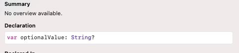
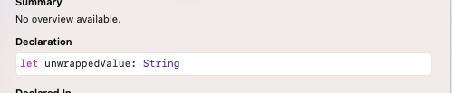

# SeSAC 1012
테이블 뷰 컨트롤러에 대해서 학습함
# Checklist
- OptionalBinding

# Optional Binding
옵셔널 바인딩은 Swift에서 옵셔널을 *안전하게* 해제하는 방법으로 다음과 같이 작성할 수 있다.
```Swift
if let unwrappedValue = optionalValue {
  print(unwrappedValue)
} else {
  print("binding fail")
}
```

또는

```Swift
guard let unwrappedValue = optionalValue else { return }
```

## if let
우선은 guard문 보다는 if문에 초첨을 두자, 처음에는 굉장히 헷갈리는 개념으로 (옵셔널 개념 자체를 처음 접했으므로) 어렵게 생각할 필요 없다. 왜냐하면 바꿔서 작성하면
```Swift
if optionalValue != nil {
  print(optionalValue)
} else {
  print("binding fail!")
}
```
값이 nil인지 아닌지 체크해주는 if 문이랑 똑같다고 볼 수 있기 때문이다. 다만 이러한 방법의 경우 한가지 단점이 있는데 if문 안에서 `optionalValue`는 여전히 옵셔널 자료형이다.<br>



이게 불편할까 싶기도 하지만 optionalValue가 Nil이 아님을 확신을 했지만 여전히 옵셔널 자료형이기 때문에 일일이 값을 호출할때마다 `!` 또는 `?` 를 붙여줘야 한다.

그게 뭐가 불편해 할 수도 있지만 코드가 길어지면 100% 귀찮아 진다.  그래서 이 과정을 if-let을 통해서 간편화 시켜준다고 생각하면 쉽다.



if let으로 선언된 값은 이렇게 옵셔널을 때고 나온다.

## guard let
if let의 불편한 점은 if문 안에서만 언래핑 된 값을 쓸 수 있다. 그러면 하위 코드들이 전부 if문 안으로 들어가게 되고 이는 다양항 문제를 불러 일으킬 수 있다. 따라서 if문 밖에서도 이 값을 유지할래! 라는 느낌이 guard let이다.

```Swift
func requestAPIData(url: String?) {
  guard let url = url else { 
    print("url is wrong")
    return
  }

  dataConvert(url: url)
}
```
guard 문은 if문이랑 다르게 헷갈릴 수 있는데 let 이후는 비슷하지만 guard의 경우 참이어야 하는 조건을 주고 바로 실패했을 시를 바로 else로 작성해준다. 보통은 fatalerror나 return 으로 조기종료를 실시한다.

# Optional Chaining
https://docs.swift.org/swift-book/LanguageGuide/OptionalChaining.html

옵셔널 체이닝은 간접적으로 nil을 체크해주는 문항으로 Swift 문법을 잘 몰랐을 때는 Xcode가 보정해주니까 크게 신경쓰지 않고 넘어 간 경우가 많았다.

```Swift
class Person{
  var name: String
  var cat: Cat?
  //init
}

class Cat {
  var name: String = "memil"
  //init
}

```
위와 같이 Person이 Cat을 가지고 있는 형태의 모델이 있을 때 
```Swift

let henry = Person(name: "Henry")

if let memil = henry.cat?.name {
  print(memil)
} else {
  print("henry has not cat")
}
```
Cat의 name 프로퍼티가 옵셔널 값이 아님에도 henry 프로퍼티의 cat이 옵셔널 이기 때문에 바인딩에 실패했을 분기를 따르게 된다.

# TableViewController
내용이 길다 [이동하기](TableViewController.md)

# Assignment
[테이블뷰 컨트롤러 구성하기1](https://github.com/urijan44/SeSAC-Assignments/blob/main/MyChecklist/README.md)