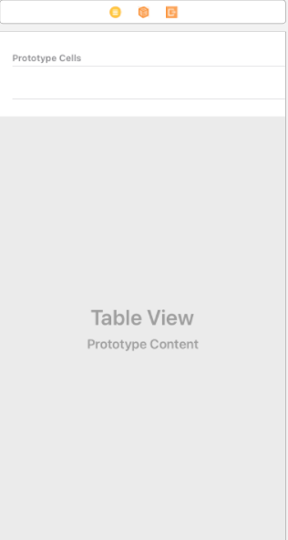
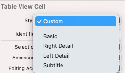
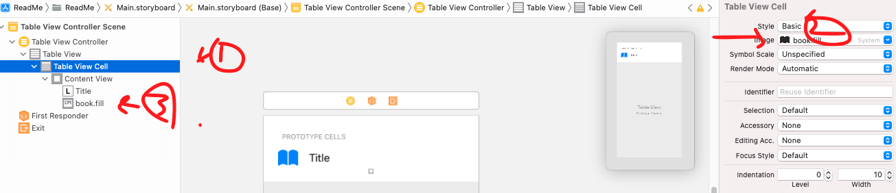
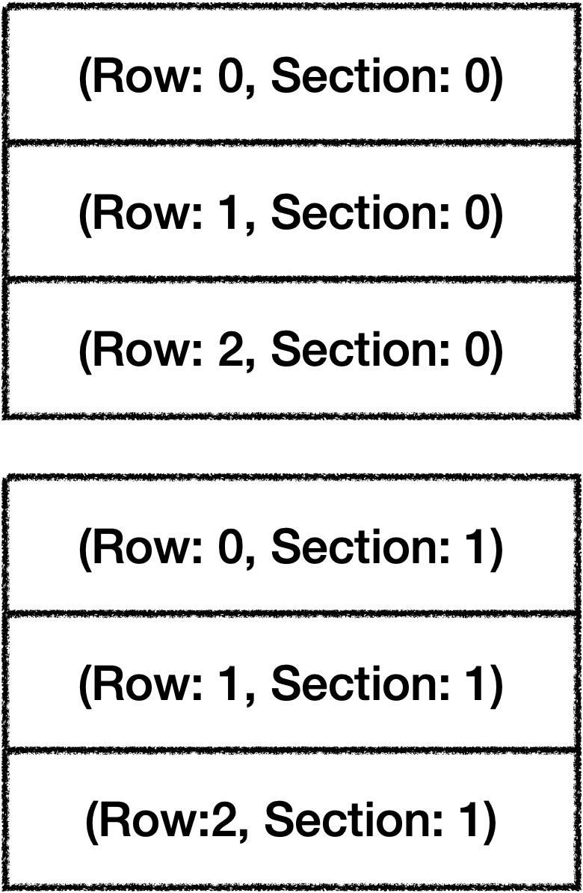
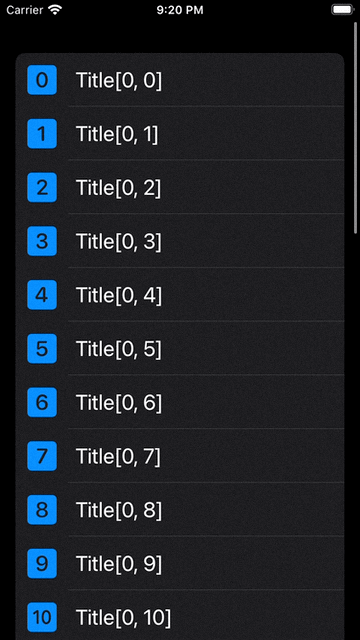
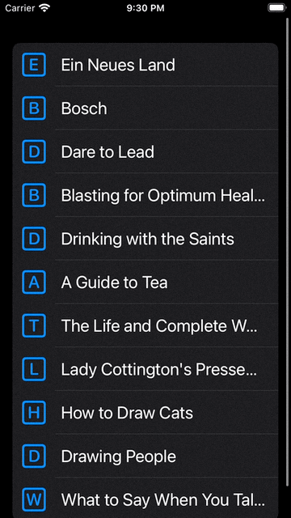
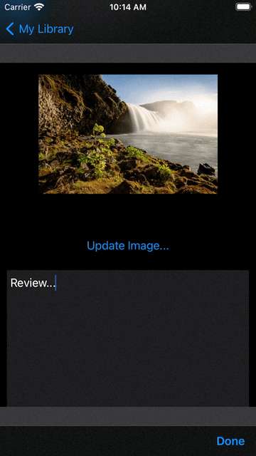
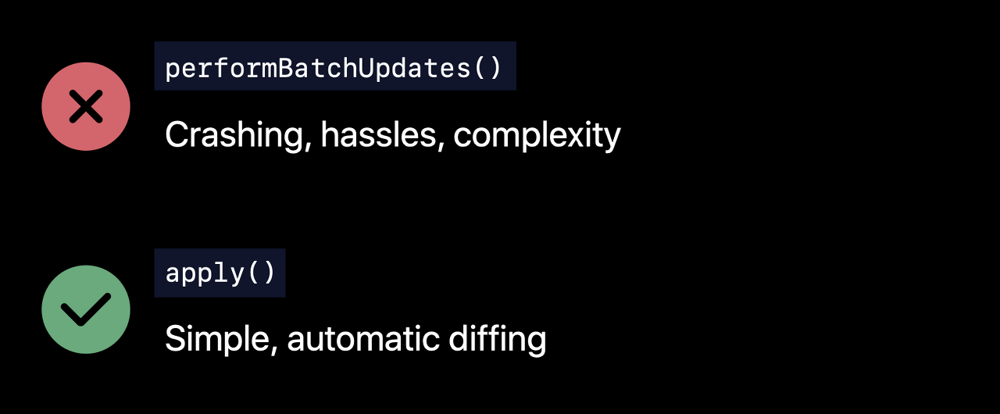

# Table View 
테이블 뷰는 UIKit에서 블록을 빌딩하는데 사용되는 통합 기능이다. 아이폰 앱만 보아도, 설정창, 메일앱, 미리알림 등등이 다 테이블 뷰로 구성되어있다.

## 테이블 뷰 설정하기
테이블 뷰는 테이블 뷰 컨트롤러를 추가함으로써 사용할 수 있다.
물론 테이블 뷰를 사용하기 위해서 테이블 뷰 컨트롤러를 꼭 사용할 필요는 없지만 단일 테이블 뷰 를 사용한다면 테이블 뷰 컨트롤러는 쉽고 빠른 선택 중 하나이다.

- 스토리보드-라이브러리 에서 Table View Controller 를 꺼낸다.

|사진|테이블 뷰 기본|
|:--:|:-:|
|1-1||

이 부분에서 많이 당황할 수 있다. 뷰 컨트롤러는 내가 마음대로 꾸밀 수 있는 도화지라면 테이블 뷰 컨트롤러는 프로토타입 셀이라는 컨테이너 뷰 하나만 있고 아래 회색처리 된 부분에는 그 무엇도 넣을 수가 없다.

어렵게 생각할 필요 없다. 프로토타입 셀은 UI디자인만 해주면 나머지는 코드로 데이터를 작성한다고 생각하면 된다.

왜 한줄의 셀만 있나요? 라고 물어본다면 몇개나 될지 모르는 셀을 일일이 직접 셀을 만들어 주지는 않기 때문이다. 프로토타입 셀은 여기에 표시할 셀의 대표 `모양새`라고 이해하면 편하다.

### 테이블 뷰 셀 스타일
|사진|테이블 뷰 셀 스타일|
|:--:|:-:|
|1-2||

테이블 뷰 셀은 커스텀을 포함해 총 5가지 스타일이 있는데 해당 스타일을 통해 심플한 UI구성은 바로 처리할 수 있다.
Basic은 UILabel이 바로 존재하며
Right Detail, Left Detail은 각각 방향에 레이블이 하나씩 더 들어간다.
서브타이틀은 타이틀 레이블 아래에 서브 타이틀 레이블을 생성해 준다.

우선 베이직으로 생성하자

스타일 바로 아래에 이미지 란이 있는데 해당 이미지는 셀 왼쪽에 바로 표시된다. 이미지를 등록하면 Content View안에 UIImage 가 생성된다.
|사진|테이블 뷰 셀 스타일|
|:-:|:-:|
|1-3||

이 상태에서 앱을 실행 해보면 화면에 아무것도 표시되지 않는다! 왜일까?

아까 말했듯 프로토타입 셀은 대표 UI디자인으로 디자인만 표시된 것일 뿐 데이터 없이는 아무것도 표시해주지 않는다. 코드에서 해당 프로토타입 셀에 데이터가 없음! 이라고 얘기해주니 프로토타입 셀은 그럼 안보여줘 라고 반응 한 것일 뿐! 당황하지 말자.

## 테이블 뷰 데이터 추가하기
테이블 뷰의 데이터 전달은 DataSource Protocol로 전달된다. 실제로 테이블 뷰의 데이터를 관리하기는 하지만 DataSource는 데이터의 중간 매니저일뿐 특별한 타입이 아니다.
데이터 소스는 테이블 뷰에 얼마나 셀이 있니, 각 셀에 어떤 데이터가 들어가니, 테이블 뷰의 섹션은 몇개니, 각 셀의 높이는 뭐니 와 같은 기능을 담당하고 있다.
사용자는 각 메소드에 셀은 몇개야, 이 셀에는 이 데이터를 넣을꺼야 라고 대답을 해주기만 하면 된다.

우선 가장 필수적인 DataSource 메소드 두가지를 살펴보자
1. numberOfRowsInSection: 셀이 총 몇개니! 라고 물어본다. 50개라고 답변해주면 셀이 50개가 나온다.
2. cellForRowAt: 셀이 어떻게 구성되니 라고 물어본다. 여기서 우리는 0번셀에는 0번데이터, 1번셀에는 1번 데이터 넣어줘 라고 하면 된다. 또 0번 셀의 레이블 제목은 0번 셀이라고 해줘라는 작업도 한다.

스토리보드에서 생성한 테이블 뷰 컨트롤러를 연결해줄 테이블 뷰 컨트롤러.swift 클래스를 만들고 다음과 같이 작성해준다.
```Swift
import UIKit

class LibraryViewController: UITableViewController {

  override func viewDidLoad() {
    super.viewDidLoad()
  }
}


//MARK: - DataSource
extension LibraryViewController {
  override func tableView(_ tableView: UITableView, numberOfRowsInSection section: Int) -> Int {
    33
  }
  
  override func tableView(_ tableView: UITableView, cellForRowAt indexPath: IndexPath) -> UITableViewCell {
    //code
  }
}
```
우선 nmberOfRowsInSection에 33개의 셀이 있다고 전달해 주자.
cellForRowAt은 조금 복잡하다.

우선 `Dequeue Cell`이라는 개념을 보자 위에서 테이블의 셀이 33개라고 알려주었는데 데이터에 따라 100개가 넘어갈 수도 있다.
테이블 뷰는 이 100개나 되는 셀을 화면에 동시에 표현할 일은 없다. 화면에 몇개만 해도 가득 차기 때문에!, 따라서 실제로 화면에 보여지는 셀은 일부만이고 스크롤 동작을 하면 화면에서 사라지는 셀을 다시 가져와 표현한다. 이것이 셀을 Dequeue해서 Reuse 하는 개념이다.

cellForRowAt에서 UITableViewCell을 리턴하도록 되어있는데, 위에서 얘기했던 셀을 Dequeue해서 재사용하는 메소드를 사용한다.
그게 바로
`dequeueReusableCell(withIdentifier:for:) -> UITableViewCell`이다.

- withIdentifier에는 셀의 identifier가 들어간다. 스토리보드에서 셀의 아이디에 연결되는 부분이다.
- for 에는 IndexPath가 전달되는데 IndexPath는 1차원 배열로 치자면 index와 같다. 
```Swift
let arr = [1,2,3,4,5]
```
라는 배열이 있으면 우리는 arr에 a[0], a[1] 이런식으로 인덱싱으로 접근 할 수 있다. IndexPath가 그거다. 근데 왜 인덱스가 아니고 인덱스 패스냐?

테이블 뷰의 셀은 row라는 이름으로 인덱싱을 하는데 row 뿐만 아니라 section도 가지고 있다. 2차원 배열과 같다고 생각 할 수 있다.
section은 셀안에서 주제를 나눈다고 생각하면 된다.

당장 아이폰에서 연락처 앱을 열어보면 이름의 초성으로 ㄱ으로 시작하는 이름 모음, ㄴ으로 시작하는 이름으로 나뉘어져 있을 것이다. 여기서 ㄱ과 ㄴ이 각각 섹션이다.

|사진|IndexPath|
|:-:|:-:|
|1-4||

그러니까 두가지 인덱스로 경로를 나타내므로 IndexPath인 것이다.

이제 cellForRowAt을 통해 cell에 데이터를 넣어주자.
1. 스토리보드에서 셀에 표시된 label에 tag 1000, imageView에 tag 1001을 할당해줬다.
2. cellForRowAt에 다음과 같이 작성한다.

```Swift
  override func tableView(_ tableView: UITableView, cellForRowAt indexPath: IndexPath) -> UITableViewCell {
    let cell = tableView.dequeueReusableCell(withIdentifier: "BookCell", for: indexPath)
    
    let book = Book(title: "Title\(indexPath)", author: "Author \(indexPath)", image: UIImage(systemName: "\(indexPath.row).square.fill")!)
    
    let label = cell.viewWithTag(1000) as! UILabel
    let image = cell.viewWithTag(1001) as! UIImageView
    
    label.text = book.title
    image.image = book.image
    
    return cell
  }
```

`dequeueReusableCell(withIdentifier:for:)`을 통해 cell 인스턴스를 생성하고 (이 과정에서 cell이 가진 객체들을 사용할 수 있다. 지금은 viewWithTag로 가져왔다.) iOS14 까지는 cell.textLabel?로 바로 사용할 수 있었지만 15부터 deprecate 되었다. 태그를 통해 전달했다.

셀에 각각 데이터를 전달 후 해당 셀을 리턴하면 된다.

|사진|cellForRowAt|
|:-:|:-:|
|1-5||

짠! DataSource에서 작성한 대로 33개의 셀에 내용이 전달되어 표시된다!


## dequeueReusableCell(withIdentifier:) vs dequeueReusableCell(withIdentifier:for:)
dequeueReusableCell을 보면 indexPath를 받는 경우와 받지 않는 경우가 있는데 indexPath를 받지 않는 메소드가 더 오래되었으며 이 경우 UITableViewCell? 을 리턴한다. 따라서 언래핑 과정이 필요하다. indexPath라는 추가적인 참조가 없기 때문에 재사용 가능한 셀이 없을 경우 nil을 리턴하기 때문이다.

## 다시 Dequeuing Cell
이제 본격적으로 데이터 모델을 넣어보자
나는 books라는 책 이름과 저자가 들어있는 Book 모델의 배열을 만들어 셀에 전달할 것이다.

그러면 다시 이렇게 작성할 수 있겠다

```Swift
//MARK: - DataSource
extension LibraryViewController {
  override func tableView(_ tableView: UITableView, numberOfRowsInSection section: Int) -> Int {
    Library.books.count
  }
  
  override func tableView(_ tableView: UITableView, cellForRowAt indexPath: IndexPath) -> UITableViewCell {
    let cell = tableView.dequeueReusableCell(withIdentifier: "BookCell", for: indexPath)
    
    let book = Library.books[indexPath.row]
    
    let label = cell.viewWithTag(1000) as! UILabel
    let image = cell.viewWithTag(1001) as! UIImageView
    
    label.text = book.title
    image.image = book.image
    
    return cell
  }
}
```
1. numberOfRowsInSection에는 셀이 몇개냐고 물어보기 때문에 내가 생성한 Book 배열의 개수만큼 있으면 된다. 따라서 books.count
2. cell 데이터의 경우 아까 indexPath 통째로 전달했을 대 화면에 Title[0, 0]식으로 표시된 거 기억 날 것이다. 아래로 내려갈 수록 [0, 1], [0, 2] 이런식으로 접근하는데 뒤에 부분 인덱스만 필요하므로 indexPath.row를 하면 해당 인덱스를 얻을 수 있다.

|사진|Cell Add Data|
|:-:|:-:|
|1-6||

짜잔 데이터가 정상적으로 들어갔다.

다시 이 과정을 정리해보자면

1. 테이블 뷰 컨트롤러 생성
2. 프로토타입 셀로 설정(UI만 구성 데이터를 전달하면 셀이 몇개건 자동으로 생성된다.)
3. DataSource 작성(셀의 개수, 셀의 구성)

## Navigate to a Detail View
지금까지 만든 앱을 보면 셀을 눌렀을 때 책의 자세한 내용을 보여줘야 할 것처럼 생겼다.

셀을 눌러서 디테일 뷰로 데이터 전송과 화면 전환을 하는 법은 다양하게 있는데 내가 자주 사용했던 방법은

### didSelectRowAt
`TableViewControllerDelegate의 didSelectRowAt` 을 사용하면 선택한 셀의 indexPath를 받을 수 있다. 

```Swift
  override func prepare(for segue: UIStoryboardSegue, sender: Any?) {
    if segue.identifier == "ShowDetailBook" {
      guard let controller = segue.destination as? DetailViewController else { return }
      guard let book = sender as? Book else { return }
      print(book)
      controller.book = book
    }
  }

//MARK: - Delegate
extension LibraryViewController {
  override func tableView(_ tableView: UITableView, didSelectRowAt indexPath: IndexPath) {
    let book = Library.books[indexPath.row]
    performSegue(withIdentifier: "ShowDetailBook", sender: book)
  }
}
```
참고로 이때 주의할 점은 스토리보드에서 세그를 연결할 때 셀에서 디테일 뷰로 연결하는게 아니라 LibraryViewController에서 세그를 연결해야 한다.
셀을 눌러서 세그를 연결하는 방법은 따로있다!

### Cell Select, IBSegueAction
이 방법은 셀에서 DetailViewControoller에 연결했을 때 유용하게 쓸 수 있다.
우선 스토리보드에서 셀에서 ViewController로 연결해서 세그를 만든다.

그런 다음 DetailViewController class를 만들고 연결한다.

```Swift
import UIKit

class DetailViewController: UIViewController {
  
  let book: Book
  
  @IBOutlet weak var titleLabel: UILabel!
  @IBOutlet weak var authorLabel: UILabel!
  @IBOutlet weak var imageView: UIImageView!
  
  override func viewDidLoad() {
    super.viewDidLoad()
    
    titleLabel.text = book.title
    authorLabel.text = book.author
    imageView.image = book.image
    
  }
  
  required init?(coder: NSCoder) { fatalError("This shoud never be called!") }

  init?(coder: NSCoder, book: Book) {
    self.book = book
    super.init(coder: coder)
  }
}
```
여기서 프로퍼티로 let book: Book 이라고만 선언하게 되면 클래스에 생성자가 필요하다고 한다. 이때 데이터 전달을 위한 coder init을 위 코드 처럼 생성해주면 된다.

그 다음 스토리보드의 세그를 원래 테이블 뷰로 아웃렛은 연결해서
showDetailView()로 네이밍 한다.

```Swift
  @IBSegueAction func showDetailView(_ coder: NSCoder) -> DetailViewController? {
    guard let indexPath = tableView.indexPathForSelectedRow else { fatalError("Nothing selected!")}
    
    let book = Library.books[indexPath.row]
    
    return DetailViewController(coder: coder, book: book)
  }
```
셀을 선택하게 되면 indexPathForSelectedRow를 통해 indexPath가 전달이 되고 이를 이용해 book 인스턴스를 생성
ViewController 생성자를 리턴하게 되면 셀을 눌러서 데이터 전달이 가능하다.

### ReloadData
tableView는 데이터가 변하면 바로 반영되지는 않는다. 적절한 시기에 tableView.reloadData()를 호출하여 데이터를 테이블 뷰에 반영할 필요가 있다.

```Swift
  //MARK: - IBAction
  @IBAction func updateImage() {
    let imagePicker = UIImagePickerController()
    imagePicker.delegate = self
    imagePicker.sourceType =
    UIImagePickerController.isSourceTypeAvailable(.camera)
    ? .camera
    : .photoLibrary
    imagePicker.allowsEditing = true
    present(imagePicker, animated: true)
  }

extension DetailViewController: UIImagePickerControllerDelegate, UINavigationControllerDelegate {
  func imagePickerController(_ picker: UIImagePickerController, didFinishPickingMediaWithInfo info: [UIImagePickerController.InfoKey : Any]) {
    guard let selectedImage = info[.editedImage] as? UIImage else { return }
    imageView.image = selectedImage
    Library.saveImage(selectedImage, forBook: book)
    dismiss(animated: true, completion: nil)
  }
}

```
Book모델에 사진을 저장하는 액션이 있다고 가정(UIImagePicker.... PHPicker 못썼다.)

지금 같은 경우는 DetailViewController에서 저장 등의 버튼으로 dismiss 되는게 아니라 그냥 뒤로가기 버튼을 눌러서 LibraryViewController 로 이동하는데 이때 LibraryViewController는 viewWillApear를 호출함으로 viewWillAppear에 tableView.reloadData()를 넣어두도록 하자

## Custom Cell

셀을 좀더 다이나믹 하게 사용하고 싶다면 기본 정의된 스타일 말고 커스텀 셀을 사용할 수 있다.

1. 우선 스토리보드에서 셀 타입을 커스텀으로 변경하자.
2. BookCell.swift 를 만든다. 클래스는 UITableViewCell이다.
3. BookCell에는 title, author, review 레이블이 있고, readMeBookmark, bookThumbnail이 UIImageView로 있다. 이들 모두 IBOutlet으로 만들어 주자.
4. 스토리보드에서 셀 클래스를 연결 시켜 주고 아웃렛 연결

원래는 cell의 textLabel등을 tag로 가져왔는데 이제는 아래처럼 코드를 바꿔준다.

```Swift
  override func tableView(_ tableView: UITableView, cellForRowAt indexPath: IndexPath) -> UITableViewCell {
    guard let cell = tableView.dequeueReusableCell(withIdentifier: "\(BookCell.self)", for: indexPath) as? BookCell else { fatalError("Could not create BookCell")}
    
    let book = Library.books[indexPath.row]
    
    cell.titleLabel.text = book.title
    cell.authorLabel.text = book.author
    cell.bookThumbnail.image = book.image
    cell.bookThumbnail.layer.cornerRadius = 12
    
    return cell
  }
```
cell을 BookCell로 타입캐스팅 해 주고 이제는 label이나 imageview등을 cell의 프로퍼티로 접근해서 지정해 주면 된다.

## Static Cell
그러면 Dynamic Cell 타입은 잘 알겠는데 그러면 코드로 다 구성 하면 되지 Static Cell은 쓸일이 있을까?

물론 이것도 다이나믹 셀로 작성할 수도 있지만 스태틱 셀을 이용해서 원래 뷰컨트롤러로 작성했던것을 스크롤링 되게 만들 수도 있다.

|사진|StaticCell|
|:-:|:-:|
|1-7||

키보드 팝업에 따른 뷰 이동을 주지 않았음에도 자동으로 스크롤링 되는 장점이 있다.
원래도 스택뷰와 오토레이아웃 제약으로 나뉘어야 될 구분들도 각각 static Cell 안에서 구분되기 때문에 편하게 나뉘어 진다는 장점도 있다.

## Section
TableView는 주제별로 섹션을 나눌 수 있다. 아이폰 기본 앱인 연락처에서 초성별로 연락처가 나뉘어 있는데 ㄱ.. ㄴ... 이런식으로 적혀있는게 섹션이다.
섹션에 따라 데이터를 따로 전달할 수 있고, 당연하게도 커스텀도 가능하다.

- 커스텀 뷰를 사용할 시 클래스는 아래처럼 생성할 수 있다.
```Swift
class LibraryHeaderView: UITableViewHeaderFooterView {
  static let resureIdentifier = "\(LibraryHeaderView.self)"
  @IBOutlet var titleLabel: UILabel!
}
```

우선 테이블 뷰의 DataSource에서
`numberOfSections`의 리턴값에 따라 섹션 수가 결정 된다.

```Swift
  override func tableView(_ tableView: UITableView, numberOfRowsInSection section: Int) -> Int {
    switch section{
    case 0:
      return 1
    default:
      return Library.books.count
    }
  }
```
섹션에 따라 표시할 Row의 수를 결정할 수도 있다.


```Swift
  override func tableView(_ tableView: UITableView, cellForRowAt indexPath: IndexPath) -> UITableViewCell {
    
    switch indexPath.section {
    case 0:
      let cell = tableView.dequeueReusableCell(withIdentifier: "NewBookCell", for: indexPath)
      return cell
    default:
      guard let cell = tableView.dequeueReusableCell(withIdentifier: "\(BookCell.self)", for: indexPath) as? BookCell else { fatalError("Could not create BookCell")}
      
      let book = Library.books[indexPath.row]
      
      cell.titleLabel.text = book.title
      cell.authorLabel.text = book.author
      cell.bookThumbnail.image = book.image
      cell.bookThumbnail.layer.cornerRadius = 12
      return cell
    }
  }
```
cellForRowAt에서도 섹션에 따라 다르게 표시하도록 디자인을 할 수 있고

```Swift
//MARK: - Delegate
extension LibraryViewController {
  override func tableView(_ tableView: UITableView, titleForHeaderInSection section: Int) -> String? {
    return section == 1 ? "Read Me!" : nil
  }
  
  override func tableView(_ tableView: UITableView, viewForHeaderInSection section: Int) -> UIView? {
    if section == 0 { return nil }
    
    guard let headerView = tableView.dequeueReusableHeaderFooterView(withIdentifier: LibraryHeaderView.resureIdentifier) as? LibraryHeaderView else { return nil }
    
    headerView.titleLabel.text = "Read Me"
    return headerView
  }
  
  override func tableView(_ tableView: UITableView, heightForHeaderInSection section: Int) -> CGFloat {
    return section != 0 ? 60 : 0
  }
}              ㅃㅃ
```
viewForHeaderInSection 을 통해 뷰 자체를 커스텀 하거나, titleForHeaderInSection으로 타이틀 이름만 바꿀 수도 있다. 지금은 헤더만 했는데 Footer(푸터)도 똑같이 가능하다.

## Diffable Data Source
원래 테이블 뷰(컬렉션 뷰에도 적용됨)에서 셀을 구성하는 데에 사용했던 프로토콜은 Data Source 프로토콜로 
1. 데이터를 변경한다.
2. 변경된 데이터를 UI에 반영하기 위해 reloadData를 한다.

위 과정을 통해 테이블 뷰를 사용해 왔다. 물론 잘 사용해 왔지만 간혹 데이터가 원하는 순간에 업데이트 되지 않거나, 데이터와 모델이 충돌하는 경우도 있다고 한다.

[Advances in UI Data Sources](https://developer.apple.com/videos/play/wwdc2019/220/)

Data Source 역할을 하는 Data Controller가 자신만의 버전 truth를 가지고 있는데 UI역시 truth를 가지고 있다. 이러한 상호 truth가 일치하지 않게되면 에러가 발생하게 된다. 

그래서 새로운 개념을 도입하게 된 것이 바로 `Diffable Data Source`이다. 이것은 기존 Data Source 와는 다르게 프로토콜이 아니라 제네릭 클래스로 Diffable Data Source가 Data Source 프로토콜을 채용하고 있다.

### Apply

|사진|Diffable|
|:-:|:-:|
|1-8||


Diffable DataSource의 장점은 performBatchUpdates를 사용하지 않고 apply()라는 것을 사용한다.
쉽게말하면 원래 데이터를 쓰고, UI를 갱신하는 것을 분리해서 동작했다면 apply라는 메소드를 통해 단일화 한것이다.

### Snapshot
snapshot이라는 개념이 도입되는데 이는 현재 UI State의 truth이다. 원래 테이블 뷰와 같은 데이터에 접근할 때 section,row로 접근했다면 snapshot을 통해 indexPath가 아닌 Identifier로 접근하게 된다.

기존 스냅샷(데이터)에 
FOO, BAR, BIF가 있었는데 컨트롤러가 변경되었다. 변경된것을 newSnapshot으로 볼 수 있고 이를 Apply하면 최종 스냅샷이 적용된다.

### 그래서 어떻게 쓰면 되는데

0. TableViewController에서 UITableViewDiffableDataSource 인스턴스 생성
1. DiffableDataSource 클래스 선언하기
2. DiffableDataSource 에서 DataSource와 같은 내용 작성해주기

위 순서로 작성할 것이다.

우선 클래스 선언
```Swift
var dataSource: UITableViewDiffableDataSource<Section, Book>!
```
원래 DataSource 있던 부근즘에 선언해놓자
DiffableDataSource 클래스는 기존 Section, Row를 `SectionIdentifierType` 과 `ItemIdentifierType`으로 바꾸어서 본다. 원애 데이터소스에서 Section이 Section이고 Row는 Item으로 보자

> @MainActor class UITableViewDiffableDataSource<SectionIdentifierType, ItemIdentifierType> : NSObject where SectionIdentifierType : Hashable, ItemIdentifierType : Hashable

위 문서 내용을 보면 알겠지만 섹션과 아이템에 들어가는 타입 모두 Hashable이니 주의할것

나는 읽은 책 관리하는 앱을 만들고 있으니 Section은 addNew, readMe, finished로 구분된다.
```Swift
enum Section: String, CaseIterable {
  case addNew
  case readMe = "Read Me!"
  case finished = "Finished"
}
```
참고로 열거형은 멤버들이 Hashable을 준수하면 자동으로 합성된다!

Book 모델은 알아서 Hashable 프로토콜 채용 하도록 하고

그리고 나서 원래 DataSource를 작성하기 위한 부분에 기존 DataSource를 모두 주석처리!없으면 말고

### DataSource 대체 작성
다음과 같이 작성해 주었다.
```Swift
//MARK: - DataSource
extension LibraryViewController {
  func configureDataSrouce() {
    dataSource = UITableViewDiffableDataSource(tableView: tableView) { (tableView, indexPath, book) -> UITableViewCell? in
      switch indexPath.section {
      case 0:
        let cell = tableView.dequeueReusableCell(withIdentifier: "NewBookCell", for: indexPath)
        return cell
      default:
        guard let cell = tableView.dequeueReusableCell(withIdentifier: "\(BookCell.self)", for: indexPath) as? BookCell else { fatalError("Could not create BookCell")}
        cell.titleLabel.text = book.title
        cell.authorLabel.text = book.author
        
        cell.bookThumbnail.image = book.image ?? LibrarySymbol.letterSquare(letter: book.title.first).image
        
        cell.bookThumbnail.layer.cornerRadius = 12
        if let review = book.review {
          cell.reviewLabel.text = review
          cell.reviewLabel.isHidden = false
        }
        cell.readMeBookmark.isHidden = !book.readMe
        return cell
      }
    }
  }
}
```
내용은 사실 `cellForRowAt`이랑 똑같다! dataSource 인스턴스에 UITableViewDiffableDataSource를 생성자로 전달
그리고 클로저로 UITableViewCell을 전달해 준다.

요 작업으로 numberOfSections, numberOfRowsInSection, cellForRowAt을 모두 처리하게 된다.

위 내용을 보면 cellForRowAt이랑 작업 내용이 완전히 똑같다고 생각할 수도 있다. 실제로도 99% 똑같다.
한가지 다른 점이라면 원래 cell에 데이터를 전달할때 데이터 매니저에서 모델 배열에 section, row로 접근해서 인스턴스를 생성하는데
```Swift
let book = Library.books[indexPath.row]
cell.titleLabel.text = book.title
cell.authorLabel.text = book.author
cell.bookThumbnail.image = book.image
cell.bookThumbnail.layer.cornerRadius = 12
```
이 과정이 생략되었는데 DiffableDataSource는 Identifier로 이미 해당 셀 내용을 추적하고 있기 때문! 

### Update Data Source = New Snapshot
아까 말했지만 데이터와 UI를 업데이트 하는 것은 Snapshot을 통해 이루어진다고 했다.
해당 메소드를 작성해 볼 것이다.

```Swift
func update() {
    
    //1
    var newSnapshot = NSDiffableDataSourceSnapshot<Section, Book>()
    //2
    newSnapshot.appendSections(Section.allCases)
    let booksByReadMe: [Bool: [Book]] = Dictionary(grouping: Library.books, by: \.readMe)
    for (readMe, books) in booksByReadMe {
      var sortedBooks: [Book]
      switch sortStyle {
      case .title:
        sortedBooks = books.sorted { $0.title.localizedCaseInsensitiveCompare($1.title) == .orderedAscending }
      case .author:
        sortedBooks = books.sorted { $0.author.localizedCaseInsensitiveCompare($1.author) == .orderedAscending }
      case .readMe:
        sortedBooks = books
      }
      //3
      newSnapshot.appendItems(sortedBooks, toSection: readMe ? .readMe : .finished)
    }
    newSnapshot.appendItems([Book.mockBook], toSection: .addNew)
    //4
    dataSource.apply(newSnapshot)
  }
```
남의 코드라서 복잡해 보일 수 있으니까 잘게 쪼개어서 설명해보자면

1. 새 스냅샷 생성

2. 섹션 생성 ( 나의 경우 새책 등록, 안읽은책, 읽은책 )
```Swift
mutating func appendSections(_ identifiers: [SectionIdentifierType])
```
3. 해당 섹션에 맞는 데이터 넣어주기

```Swift
mutating func appendItems(_ identifiers: [ItemIdentifierType], toSection sectionIdentifier: SectionIdentifierType? = nil)
```

4. Apply 하기
```Swift
nonisolated func apply(_ snapshot: NSDiffableDataSourceSnapshot<SectionIdentifierType, ItemIdentifierType>, animatingDifferences: Bool = true, completion: (() -> Void)? = nil)
```

위 과정으로 이루어진다. 

이제 위에서 작성한 내용 중 configureDataSource는 viewDidLoad에서 한번 호출해주고 update 메소드는 viewDidLoad, viewWillAppear 등지에 선언하면 되겠다.

또 한가지 수정할 것은 IBSegueAction에 Book전달을 원래는 
```Swift
let book = Library.books[indexPath.row]
```
이걸로 했는데 DiffableDataSource를 사용하니

```Swift
let book = dataSource.itemIdentifier(for: indexPath)
```
로 작성할 수 있겠다

이제 update메소드를 데이터가 수정되는 순간 (새 데이터 작성, 셀 에디트 등)마다 호출되게 하면 되겠다

## Diffable Data Source 끝내기
개념이 잘 와닿지도, 왜 써야 할지도 아직은 모를 수도 있고 나도 잘 모르는데, 기존 방법으로도 전혀 문제는? 없으니까(앞서 얘기했든 업데이트 이슈가 있지만) 찬찬히 시도해 보면 될 것 같다. 참고로 Diffable Data Source는 iOS 13부터이다.

## Cell 삭제하기
주로 뭐 체크리스트나, 메모 등의 테이블 뷰를 사용하다보면 행을 삭제해야 하는 순간이 당연하게 온다. 이러한 삭제 동작을 수행해 보자

우선 DataSource에 `canEditRowAt` 메소드가 있다. Diffable도 똑같으니 참고

리턴값이 Bool인데 섹션별로 어디는 삭제가 되고 안되고를 나누어서 줄 수 있겠다
```Swift
 override func tableView(_ tableView: UITableView, canEditRowAt indexPath: IndexPath) -> Bool {
    indexPath.section == snapshot().indexOfSection(.addNew) ? false : true
  }
```
요거는 Diffable DataSource이긴 하지만 그냥 DataSource도 똑같다. indexPath.section == 0 ? true : false 이렇게 작성해버리면 되겠다.

위 메소드는 어디 섹션을 삭제 할 수 있냐 없냐를 물어보는 도우미 메소드로 실제로 삭제한느 동작은 아래 코드에서 한다
```Swift
  override func tableView(_ tableView: UITableView, commit editingStyle: UITableViewCell.EditingStyle, forRowAt indexPath: IndexPath) {
    if editingStyle == .delete {
      guard let book = self.itemIdentifier(for: indexPath) else { return }
      Library.delete(book: book)
      update(sortStyle: currentSortStyle)
    }
  }
```
editingStyle 이 .delete 일때 해당 모델과 뷰에서 삭제해주는 역할을 한다 여기까지만 작성해주면 셀을 왼쪽으로 Swipe했을때 Delete가 나온다!

DataSource에서는 이렇게도 작성할 수 있다.
```Swift
  override func tableView(_ tableView: UITableView, commit editingStyle: UITableViewCell.EditingStyle, forRowAt indexPath: IndexPath) {
    let indexPaths = [indexPath]
    switch indexPath.section {
    case 0:
      checklists.remove(at: indexPath.row)
    default:
      donotList.remove(at: indexPath.row)
    }
    tableView.deleteRows(at: indexPaths, with: .automatic)
  }
```

## Cell 이동하기
위에서 했던 edit와 같이 move도 할 수 있는데 구조가 똑같다. canMoveRowAt가 있고, moveRowAt이 있다. canMoveRowAt은 row에 따라 이동 기능을 잠금하거나, 활성화 할 수 있고
moveRowAt은 실제로 move 동작시 데이터를 처리한다.
```Swift
  override func tableView(_ tableView: UITableView, canMoveRowAt indexPath: IndexPath) -> Bool {
    if indexPath.section != snapshot().indexOfSection(.readMe)
        || currentSortStyle == .readMe {
      return false
    } else{
      return true
    }
  }
  
  override func tableView(_ tableView: UITableView, moveRowAt sourceIndexPath: IndexPath, to destinationIndexPath: IndexPath) {
    guard sourceIndexPath != destinationIndexPath, sourceIndexPath.section == destinationIndexPath.section,
          let bookToMove = itemIdentifier(for: sourceIndexPath),
          let bookAtDestination = itemIdentifier(for: destinationIndexPath) else {
            apply(snapshot(), animatingDifferences: false)
            return
          }
    Library.reorderBooks(bookToMove: bookToMove, bookAtDestination: bookAtDestination)
    update(sortStyle: currentSortStyle, animatingDifferences: false)
  }
```

네비게이션 컨트롤러 에 쌓인 뷰이거나 아이템을 쓰고 있다면 다음 코드로 EditButton을 추가할 수도 있다.
```Swift
///viewDidLoad
navigationItem.rightBarButtonItem = editButtonItem
```